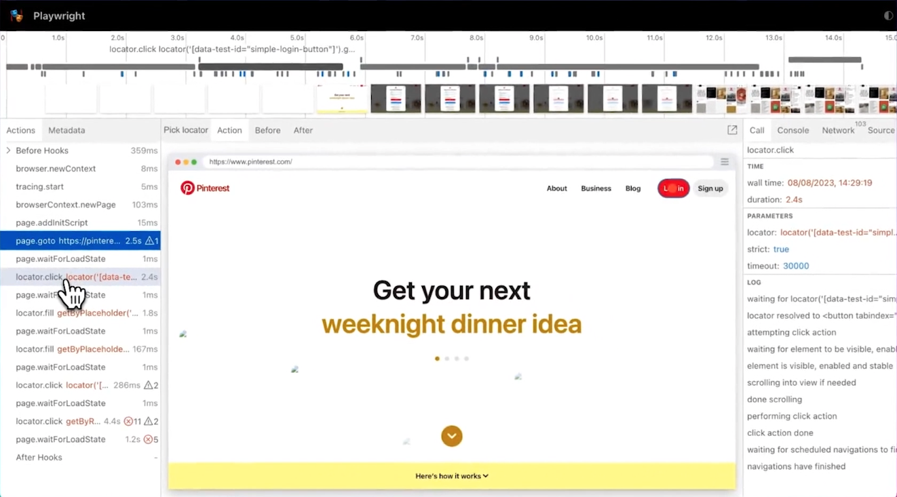

Watch a 3 min video demo:

<iframe
  width={560}
  height={315}
  src="https://www.youtube.com/embed/CGaJHpLAIq8"
  title="YouTube video player"
  frameBorder={0}
  allow="accelerometer; autoplay; clipboard-write; encrypted-media; gyroscope; picture-in-picture; web-share"
  allowFullScreen
></iframe>

## 1. All we need is your website URL

... to start the AI powered test auto-discovery. We will discover, run and maintain your UI tests.
You can [try it right now](https://app.octomind.dev/setup/url?utm_source=docs&utm_medium=txt-lnk) by setting up your first user flow at app.octomind.dev.

<Frame caption="First page of the setup flow - link to your website, screenshot 08/2023">
  
</Frame>

## 2. We will discover your user flows

Full disclosure - we auto-discover only **sign-in** user flow for now. We will let you know as we add new user flows.

<Frame caption="Test user credentials input to test the sign-in flow, screenshot 08/2023">
  
</Frame>

## 3. We will generate, host and run your test code

We will generate a [Playwright test code](https://playwright.dev/), host and run the tests for you.

## 4. We will provide test results

You will see the [test results](/test-results) in the app and in your PR comments if you integrated us into your CI pipeline.

<Frame caption="Example of Octomind test results in a commit comment, screenshot 06/2023">
  
</Frame>

## 5. You can review the broken user flow

You can go through the details, check the error log and open the [Playwright Trace Viewer](https://playwright.dev/docs/trace-viewer-intro) to see where the user flow broke.

<Frame caption="Example of Playwright Test Viewer, screenshot 08/2023">
  
</Frame>

## 6. And debug locally, if needed

Debug locally with Debugtopus. [Debugtopus is our open source tool](debugtopus) enabling you to run tests locally for easier debugging.

<Frame caption="Open source Debugtopus on GitHub, screenshot 08/2023">
  
</Frame>

## 7. We'll maintain your tests automatically

Our AI will maintain your tests when they break.
