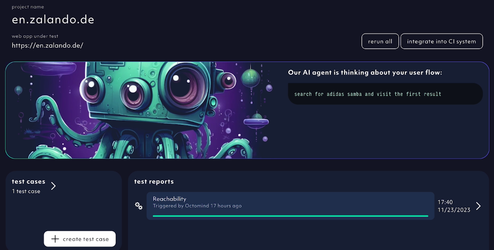

## 2024-08-09

- `UI tweak` for first time users: Test result details of user's first test run are visible directly in project overview.

<Frame caption="First time users project overview with test result detail, 08/2024">
  
</Frame>

## 2024-08-08

- `Save & run`: New button to **run and save** an edited test case at once. You can click on the `run only` button if you want to validate the test first before saving it.

<Frame caption="'save & run' the test to validate and save changes, 08/2024">
  
</Frame>

<Frame caption="'run only' to validate the test before saving it, 08/2024">
  
</Frame>

## 2024-08-06

- `AI suggesting more tests`: Similar to the AI discovery at set-up, we expanded the AI discovery feature to “spawn” individual test cases.

<Frame caption="Have the AI agent suggest more test cases, 08/2024">
  
</Frame>

- `Open status for new test cases`: In order to mark test cases coming out of **suggest more** as new (until you've opened them for the first time), we introduced a new column **open status** to properly persist the state.

<Frame caption="Open status on new suggested tests, 08/2024">
  
</Frame>

## 2024-08-05

- Speed is important. We sped up loading times on test cases overviews.
- `AI agent can scroll now`: improved scrolling behavior of our AI agents when exploring elements increasing its success rate

## 2024-07-29

- `Draftless editing`: No more draft state of a test case. Just open the test case and save your changes.

## 2024-07-23

- `Guidance through card focus`: We highlight the sections of our app to gently guide you to your **first test report**.
- `AI agent progress indicator`: We reintroduced the progress bar and updated it. At any given moment, you'll have an idea what the agent is doing.

<Frame caption="AI agent progress indicator, 07/2024">
  
</Frame>

## 2024-07-18

- `Copy paste test steps`: Use Ctrl+C Ctrl+V keystrokes (cmd+c cmd+v for mac users) to copy paste test steps within the same test or from other test cases.

<Frame caption="copy pasting steps, 07/2024">
  
</Frame>

## 2024-07-16

- `Faster AI Agent`: Natural scrolling when extracting web elements and checking for visibility took up 20% of the whole test generation process. We made it faster.
- `Test case filters`: You can filter your tests based on the test statuses, now.

  <Frame caption="test case filters, 07/2024">
    
  </Frame>

## 2024-07-11

- `Automatic login and cookie banner tests` at sign-up. When you sign up to Octomind or create new project (add a new URL):

1. AI agent goes through your site and checks for cookie banners.
2. If a cookie banner is present, it creates a cookie banner test.
3. AI agent checks if you have a login at your site.
4. If you do, it asks you for test credentials.
5. You give it your test credentials.
6. AI agent auto-generates a login test.
7. The cookie and the login tests will be populated into all new auto-generated tests as dependencies.

<Frame caption="AI agent asks for test credentials to auto-generate and run a login test, screenshot 07/2024">
  
</Frame>

## 2024-07-04

- `Mobile + tablet use`: Test case editing works better on smaller screens now.

## 2024-07-01

- `Agent benchmark automation`: Every major change in the codebase impacts the AI agent performance. We get an automated ping whether the agent does what it icons supposed to, now.

## 2024-06-27

- `Variable templates`: We fill more robust variable templates into the test when your test steps are auto-generated. [Learn more.](/variables)
- `Shadow DOM & iFrames`: It looks like we figured out how to handle them. Until you serve us the next 100 edge cases.

## 2024-06-24

- `New project overview`: Your project homepage has a new overview layout. We aimed for a less cluttered design while keeping the flexibility and all features at hand.

<Frame caption="Project overview page after sign-up, 06/2024">
  
</Frame>

## 2024-06-20

- We merged and simplified test case view. Bye bye, way too many tabs.
  <Frame caption="merged test case view, screenshot 06/2024">
    
  </Frame>

## 2024-06-17

- `shadow DOM and iFrames` - the AI agent can handle most shadow DOMs and iFrames now

## 2024-06-13

- We mark broken locators now. A yellow highlight and an indicator will point to the locator that doesn’t do the thing it’s supposed to.
  <Frame caption="screen recording of a broken locator being pinpointed, 06/2024">
    
  </Frame>

## 2024-06-10

- We removed automatically generated `link tests`. We generated too many link tests on dynamic elements that broke constantly. We will come back with a better solution.

## 2024-06-05

- We add `dependencies` automatically now. We now add a cookie banner test as dependency automatically. We will be adding more common dependencies in the future.
- less obstructive `test editing` - interaction and assertion types can be switched now

## 2024-06-04

- `AI discovery`: Instead of just giving you proposals for test cases, we now generate steps and validate the proposed test cases automatically. Tests we feel confident about are published to your test suite automatically.

## 2024-05-27

- `improved AI discovery` - delivers more functional and less reachability-focused tests. The AI agent will also suggest less functionally similar tests.

## 2024-05-23

- most of `LangChain` has been removed from our stack. Learn [why we no longer use it to build our AI agents.](https://www.octomind.dev/blog/why-we-no-longer-use-langchain-for-building-our-ai-agents)
- we support nested iFrames in snapshots now
- `steps editing` - we added drag and drop for changing order
- `AI agent` can handle elements with never ending animations and invisible input forms now, like password fields, checkboxes or radio boxes

## 2024-05-15

- ‍`reduced test flakiness` through improved timeout logic.

## 2024-05-08

- streaming `AI Agent indicators`: At any given moment, you'll know what the agent is doing during discovery or when it’s running in drafts. No more staring at a spinning circle ⭕️ wondering when it will finish.
- improved UX for step deletion
- improved `world model` of the AI agent: its ability to understand context and derive the correct actions

## 2024-05-03

- `hotkeys` added for editing test steps help you navigate between steps using arrow keys
- `test case grouping`: We will group your test cases. We started with the “link tests” category and will add more soon.
- `status icons` for test cases and step results
- `AI agent` can handle SVG elements like images and icons now
- `duplicate navigation fixed`: We reduced the frequency in which agents get stuck in loops.

## 2024-04-23

- `AI agent`: We are extracting all accessibility attributes to improve its performance.

## 2024-04-18

- `AI agent`: vision added to current agent state

## 2024-04-15

- `in-app & email notifications`: we will let you know in the app once your test run has finished or our AI agent completed its discovery. We will ONLY send you an email if your test report is red 🔴
- `scheduling test reports`: We are now enabling you run your test reports on a fixed schedule (daily/ weekly/ bi-weekly). There's even email notifications now for when your scheduled run failed so you never miss a ~beat~ bug.
  <Frame caption="screen recording 04/2024">
    
  </Frame>

## 2024-04-08

- `snapshots for picking locators`: Not familiar with selectors and DOM elements? We got you covered! Test case steps now allow you to select elements in your page visually, both for interacting with them and asserting that they are there.

  <Frame caption="screen recording 04/2024">
    
  </Frame>

- `reworked publish workflow`: whenever you save a draft of a test case, you get the option to publish it to include it in future test report runs

## 2024-04-02

- `expandable step editing`: the panel for editing test case steps now expands and gives you more space to make changes to your test cases

## 2024-02-23

- `improved stability`: made sure our app is running smoothly without hick-ups even with multiple test report running in parallel. Now our agent and test execution are serverless.
- `discover test cases`: our AI Agent will analyse your webpage and suggest multiple prompts

<Frame caption="screenshot 02/2024">
  
</Frame>

- `approval workflow`: once our AI Agent has finished the discovery, you have an option to approve or discard the provided suggestions.
  Discarding will delete the draft, while approval will start our AI Agent with the corresponding prompt

<Frame caption="screenshot 02/2024">
  
</Frame>

## 2024-02-15

- `test report generation speed up` : we are now running published test cases within a report in parallel
- `auto fix`: you can now select which test cases our AI Agent should try to auto fix once they fail

<Frame caption="screenshot 02/2024">
  
</Frame>

- `save` button for test case draft overhaul:

  we replaced the save rail with multiple buttons that were hidden in a separate screen. Now we have 3 separate buttons

  1. `save` button: to save changes made
  2. `run` button: to run the selected test case
  3. `publish` button

  The `run` button is also visible on published test cases

  <Frame caption="screenshot 02/2024">
    
  </Frame>

## 2024-02-01

- `Add a new project to your organization` added for more flexibility of managing your account

<Frame caption="Create new project button, screenshot 02/2024">
  
</Frame>

## 2024-01-26

- `Manual test creation`: We have added a low-code option to generate new tests if AI generation struggles. With increasing performance, our AI agent will do more and more of the heavy lifting. In the meantime, you can easily create a specific test case with a few clicks & adding selectors.

<iframe
  width={560}
  height={315}
  src="https://www.youtube.com/embed/nhBdwXgxF7Y"
  title="YouTube video player"
  frameBorder={0}
  allow="accelerometer; autoplay; clipboard-write; encrypted-media; gyroscope; picture-in-picture; web-share"
  allowFullScreen
></iframe>

## 2024-01-24

- Get rid off the test that doesn't spark joy. You can hard delete drafts now.

## 2024-01-22

- `Onboarding`: We want to give our users a smooth beginner experience. That is why we added an onboarding tour and helpful tooltips to make your journey of discovering all Octomind features a breeze.

<iframe
  width={560}
  height={315}
  src="https://www.youtube.com/embed/agVLnZOq1PQ"
  title="YouTube video player"
  frameBorder={0}
  allow="accelerometer; autoplay; clipboard-write; encrypted-media; gyroscope; picture-in-picture; web-share"
  allowFullScreen
></iframe>

## 2024-01-11

- We have streamlived cookie consent management throughout all our subdomains. A cookie consent banner displays when coming to our sites for the first time. Is it annoying? It is. Is it necessary? It is.

## 2024-01-08

- `Test draft validation`: now, you can validate test draft before publishing telling you if the test works properly

<Frame caption="Validated test draft, screenshot 01/2024">
  
</Frame>

## 2024-01-03

- You can add new steps to draft test cases now
- `Element highlighter`: Element that was interacted with is highlighted by a purple dot in test step screenshots

<Frame caption="Element that was interacted with is highlighted by a purple dot, screenshot 01/2024">
  
</Frame>

## 2023-12-18

- Fixed: Sometimes some of our test runs got stuck, we improved this and no stuck tests should occur anymore.
- `Selector editing`: You can now edit Playwright selectors used to find the element in question for a step

## 2023-12-13

- Delete steps option in a test case draft added
- Idle `AI agent`: our agent will let you know if it's idle and waiting for more input

## 2023-12-11

- You can edit test cases, now. Mark steps as optional, so their failure is ignored. Adjust text parameters for steps entering text or selecting a menu item. You can create test case drafts and publish them.

<Frame caption="Test cases can be created as drafts and edited, screenshot 12/2023">
  
</Frame>

## 2023-11-30

- We've added better desciptions to test steps our `AI agent` generated
- `AI agent` informs users about test case discoveries in progress

<Frame caption="AI agent informs about its progress, screenshot 11/2023">
  
</Frame>

## 2023-11-27

- `What's new` modal notification after log-in added

<Frame caption="New features modal after log-in, screenshot 11/2023">
  
</Frame>

## 2023-11-14

- `Debugtopus dialog`: The execution url is pre-filled by default, no need to copy paste
- `Test hosting`: Run all test cases from the tool OR your terminal
- **Human feedback** added to the `AI agent` by relaunching the test case discovery based on user comments

<Frame caption="Relaunch AI discovery based on your comments, screenshot 11/2023">
  
</Frame>

## 2023-11-09

- `In-context screenshots` of executed steps visibile directly in test report details
- Screenshot carousel added to review executed test steps, screenshot by screenshot

<Frame caption="In-app screenshot carousel in test report detail, screenshot 11/2023">
  
</Frame>

## 2023-11-07

- **AI discovery improved**: `AI agent` sees all elements on the page to generate better assertions

## 2023-10-31

- `CI integrations`: Previous comments with test results are collapsed by default, click to expand

<Frame caption="Previous comments in PR are collapsed, screenshot 11/2023">
  
</Frame>

## 2023-10-17

- `Chain test cases` functionality for new [AI agent discoveries](/discovery) added to UI
- `AI Agent`: improved handling of blocking overlays
- UI: improved UX when switching between test targets and organizations
- UI: progress bar for running test reports in project overview

<Frame caption="Test case chaining for AI test case discovery, screenshot 10/2023">
  
</Frame>

## 2023-10-16

- Major `AI agent` revamp:
  - Improved page content understanding
  - Fused element representation by forms
  - Analytics added to embedding generation
- Welcome modal for new users

## 2023-10-10

- Instroduction of stable IDs for an improved AI discovery
- `Choose your first tests` selection at set-up added
- Improved manual triggering of test reports

<Frame caption="Choose your first tests option at set-up, screenshot 10/2023">
  
</Frame>

## 2023-10-05

- `AI Agent` and initial test generation upgrade - improved element visibility

## 2023-10-03

- Improved UX of the `overview page` and test report order at set-up

## 2023-09-26

- `Tooltips` added to improve app onboarding experience
- Test cases can be deleted now
- `Restart test report` functionality added
- New feedback option added: Thumbs up/down of your onboarding experience

<Frame caption="Onboarding feedback thumbs up/down, screenshot 10/2023">
  
</Frame>

## 2023-09-20

**UI Improvements**:

- Improve layout of overview grid and test report header on mobile

## 2023-09-19

**Features**:

- Display error log for failed tests in the test result detail

**UI Improvements**:

- Responsiveness on mobile for snackbars
- Remove UI flashing on initial load

## 2023-09-18

**Features**:

- You can now manually create a test case from a failed discovery.
  This is useful when the discovery failed, but the generated steps are still useful.
  An example would be when the agent can not verify the success of the task, but it actually succeeded.
  This is only available for new discoveries.
- Add modal allowing the user to give feedback to octomind

**UI Improvements**:

- Settings dialog looks better on mobile
- Recording upload is more intuitive

## 2023-09-14

**Features**:

- Test case discoveries now have traces, so you can see what the agent did in the playwright trace viewer

**UI Improvements**:

- Planned steps within a test case are now expandable
- Introduce larger settings modal

## 2023-09-11

- Workaround for browser extensions that modify the html document and cause issues when displaying our page

## 2023-09-08

- `Follow links` test case on initial set-up added
- Sidebar navigation added

<Frame caption="Sidebar navigation added to the UI, screenshot 09/2023">
  
</Frame>

## 2023-08-28

- New test case on sign-up added: `Change language of the website`
- AI discovered test cases will now have an assertion generated \(if possible\)

## 2023-08-25

- **Alpha release** - `Test recorder` as a non-AI option to generate new test cases
- Security update
- AI agent upgrade - supported interactions, input error correction and analytics expanded
- `Give feedback` functionality added - schedule a feedback session with us directly from the app

<Frame caption="Scheduling feedback sessions directly from the app, screenshot 08/2023">
  
</Frame>

## 2023-08-14

- Welcome page mobile view improved
- Test recorder supports iframes now
- Error states for failed discoveries streamlined
- **Alpha release** - free prompting interface for test case discovery:

<Frame caption="Free promting window for test case discovery, screenshot 08/2023">
  
</Frame>

## 2023-08-10

- Captain Ink (AI agent) upgrade - page injection replaced navigating to a page for more stability and speed
- We introduced a basic test case available for everyone
- New welcome screen UX:

<Frame caption="Example of the new Octomind app welcome screen, screenshot 08/2023">
  
</Frame>

## 2023-08-09

- Interactible DIVs are correctly detected during discovery
- Display test failure reasons in test overview

## 2023-08-07

- Bug fix - errored display for empty list of test reports
- Cookie tracking removed from the app. We did't like them anyways.
- Test database introduced - collection of test cases displayed on the app welcome page:

<Frame caption="Example test cases displayed within a test database, screenshot 08/2023">
  
</Frame>
