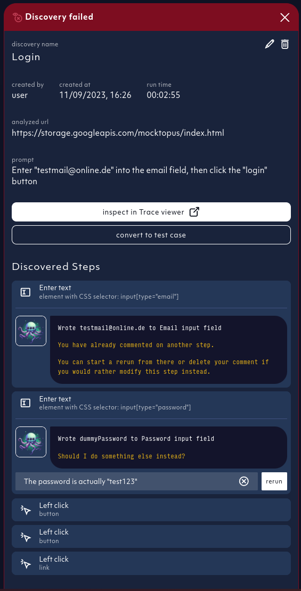
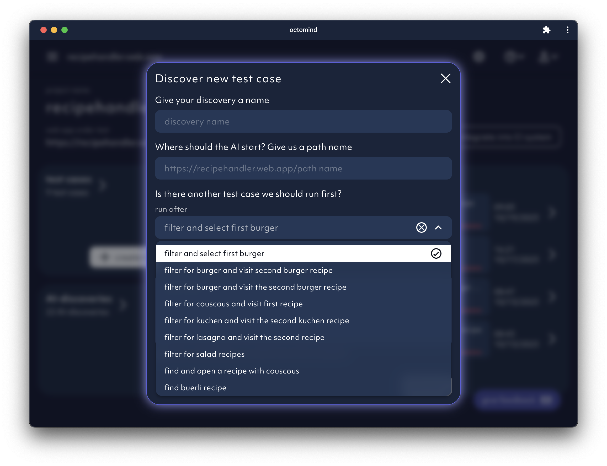

## 2024-02-23

- `improved stability`: made sure our app is running smoothly without hick-ups even with multiple test report running in parallel. Now our agent and test execution are serverless.
- `discover test cases`: our AI Agent will analyse your webpage and suggest multiple prompts

<Frame caption="screenshot 02/2024">
  
</Frame>

- `approval workflow`: once our AI Agent has finished the discovery, you have an option to approve or discard the provided suggestions.
  Discarding will delete the draft, while approval will start our AI Agent with the corresponding prompt

<Frame caption="screenshot 02/2024">
  
</Frame>

## 2024-02-15

- `test report generation speed up` : we are now running published test cases within a report in parallel
- `auto fix`: you can now select which test cases our AI Agent should try to auto fix once they fail

<Frame caption="screenshot 02/2024">
  
</Frame>

- `save` button for test case draft overhaul:

  we replaced the save rail with multiple buttons that were hidden in a separate screen. Now we have 3 separate buttons

  1. `save` button: to save changes made
  2. `run` button: to run the selected test case
  3. `publish` button

  The `run` button is also visible on published test cases

  <Frame caption="screenshot 02/2024">
    
  </Frame>

## 2024-02-01

- `Add a new project to your organization` added for more flexibility of managing your account

<Frame caption="Create new project button, screenshot 02/2024">
  
</Frame>

## 2024-01-26

- `Manual test creation`: We have added a low-code option to generate new tests if AI generation struggles. With increasing performance, our AI agent will do more and more of the heavy lifting. In the meantime, you can easily create a specific test case with a few clicks & adding selectors.

<iframe
  width={560}
  height={315}
  src="https://www.youtube.com/embed/nhBdwXgxF7Y"
  title="YouTube video player"
  frameBorder={0}
  allow="accelerometer; autoplay; clipboard-write; encrypted-media; gyroscope; picture-in-picture; web-share"
  allowFullScreen
></iframe>

## 2024-01-24

- Get rid off the test that doesn't spark joy. You can hard delete drafts now.

## 2024-01-22

- `Onboarding`: We want to give our users a smooth beginner experience. That is why we added an onboarding tour and helpful tooltips to make your journey of discovering all Octomind features a breeze.

<iframe
  width={560}
  height={315}
  src="https://www.youtube.com/embed/agVLnZOq1PQ"
  title="YouTube video player"
  frameBorder={0}
  allow="accelerometer; autoplay; clipboard-write; encrypted-media; gyroscope; picture-in-picture; web-share"
  allowFullScreen
></iframe>

## 2024-01-11

- We have streamlived cookie consent management throughout all our subdomains. A cookie consent banner displays when coming to our sites for the first time. Is it annoying? It is. Is it necessary? It is.

## 2024-01-08

- `Test draft validation`: now, you can validate test draft before publishing telling you if the test works properly

<Frame caption="Validated test draft, screenshot 01/2024">
  
</Frame>

## 2024-01-03

- You can add new steps to draft test cases now
- `Element highlighter`: Element that was interacted with is highlighted by a purple dot in test step screenshots

<Frame caption="Element that was interacted with is highlighted by a purple dot, screenshot 01/2024">
  
</Frame>

## 2023-12-18

- Fixed: Sometimes some of our test runs got stuck, we improved this and no stuck tests should occur anymore.
- `Selector editing`: You can now edit Playwright selectors used to find the element in question for a step

## 2023-12-13

- Delete steps option in a test case draft added
- Idle `AI agent`: our agent will let you know if it's idle and waiting for more input

## 2023-12-11

- You can edit test cases, now. Mark steps as optional, so their failure is ignored. Adjust text parameters for steps entering text or selecting a menu item. You can create test case drafts and publish them.

<Frame caption="Test cases can be created as drafts and edited, screenshot 12/2023">
  
</Frame>

## 2023-11-30

- We've added better desciptions to test steps our `AI agent` generated
- `AI agent` informs users about test case discoveries in progress

<Frame caption="AI agent informs about its progress, screenshot 11/2023">
  
</Frame>

## 2023-11-27

- `What's new` modal notification after log-in added

<Frame caption="New features modal after log-in, screenshot 11/2023">
  
</Frame>

## 2023-11-14

- `Debugtopus dialog`: The execution url is pre-filled by default, no need to copy paste
- `Test hosting`: Run all test cases from the tool OR your terminal
- **Human feedback** added to the `AI agent` by relaunching the test case discovery based on user comments

<Frame caption="Relaunch AI discovery based on your comments, screenshot 11/2023">
  
</Frame>

## 2023-11-09

- `In-context screenshots` of executed steps visibile directly in test report details
- Screenshot carousel added to review executed test steps, screenshot by screenshot

<Frame caption="In-app screenshot carousel in test report detail, screenshot 11/2023">
  
</Frame>

## 2023-11-07

- **AI discovery improved**: `AI agent` sees all elements on the page to generate better assertions

## 2023-10-31

- `CI integrations`: Previous comments with test results are collapsed by default, click to expand

<Frame caption="Previous comments in PR are collapsed, screenshot 11/2023">
  
</Frame>

## 2023-10-17

- `Chain test cases` functionality for new [AI agent discoveries](/discovery) added to UI
- `AI Agent`: improved handling of blocking overlays
- UI: improved UX when switching between test targets and organizations
- UI: progress bar for running test reports in project overview

<Frame caption="Test case chaining for AI test case discovery, screenshot 10/2023">
  
</Frame>

## 2023-10-16

- Major `AI agent` revamp:
  - Improved page content understanding
  - Fused element representation by forms
  - Analytics added to embedding generation
- Welcome modal for new users

## 2023-10-10

- Instroduction of stable IDs for an improved AI discovery
- `Choose your first tests` selection at set-up added
- Improved manual triggering of test reports

<Frame caption="Choose your first tests option at set-up, screenshot 10/2023">
  
</Frame>

## 2023-10-05

- `AI Agent` and initial test generation upgrade - improved element visibility

## 2023-10-03

- Improved UX of the `overview page` and test report order at set-up

## 2023-09-26

- `Tooltips` added to improve app onboarding experience
- Test cases can be deleted now
- `Restart test report` functionality added
- New feedback option added: Thumbs up/down of your onboarding experience

<Frame caption="Onboarding feedback thumbs up/down, screenshot 10/2023">
  
</Frame>

## 2023-09-20

**UI Improvements**:

- Improve layout of overview grid and test report header on mobile

## 2023-09-19

**Features**:

- Display error log for failed tests in the test result detail

**UI Improvements**:

- Responsiveness on mobile for snackbars
- Remove UI flashing on initial load

## 2023-09-18

**Features**:

- You can now manually create a test case from a failed discovery.
  This is useful when the discovery failed, but the generated steps are still useful.
  An example would be when the agent can not verify the success of the task, but it actually succeeded.
  This is only available for new discoveries.
- Add modal allowing the user to give feedback to octomind

**UI Improvements**:

- Settings dialog looks better on mobile
- Recording upload is more intuitive

## 2023-09-14

**Features**:

- Test case discoveries now have traces, so you can see what the agent did in the playwright trace viewer

**UI Improvements**:

- Planned steps within a test case are now expandable
- Introduce larger settings modal

## 2023-09-11

- Workaround for browser extensions that modify the html document and cause issues when displaying our page

## 2023-09-08

- `Follow links` test case on initial set-up added
- Sidebar navigation added

<Frame caption="Sidebar navigation added to the UI, screenshot 09/2023">
  
</Frame>

## 2023-08-28

- New test case on sign-up added: `Change language of the website`
- AI discovered test cases will now have an assertion generated \(if possible\)

## 2023-08-25

- **Alpha release** - `Test recorder` as a non-AI option to generate new test cases
- Security update
- AI agent upgrade - supported interactions, input error correction and analytics expanded
- `Give feedback` functionality added - schedule a feedback session with us directly from the app

<Frame caption="Scheduling feedback sessions directly from the app, screenshot 08/2023">
  
</Frame>

## 2023-08-14

- Welcome page mobile view improved
- Test recorder supports iframes now
- Error states for failed discoveries streamlined
- **Alpha release** - free prompting interface for test case discovery:

<Frame caption="Free promting window for test case discovery, screenshot 08/2023">
  
</Frame>

## 2023-08-10

- Captain Ink (AI agent) upgrade - page injection replaced navigating to a page for more stability and speed
- We introduced a basic test case available for everyone
- New welcome screen UX:

<Frame caption="Example of the new Octomind app welcome screen, screenshot 08/2023">
  
</Frame>

## 2023-08-09

- Interactible DIVs are correctly detected during discovery
- Display test failure reasons in test overview

## 2023-08-07

- Bug fix - errored display for empty list of test reports
- Cookie tracking removed from the app. We did't like them anyways.
- Test database introduced - collection of test cases displayed on the app welcome page:

<Frame caption="Example test cases displayed within a test database, screenshot 08/2023">
  
</Frame>
