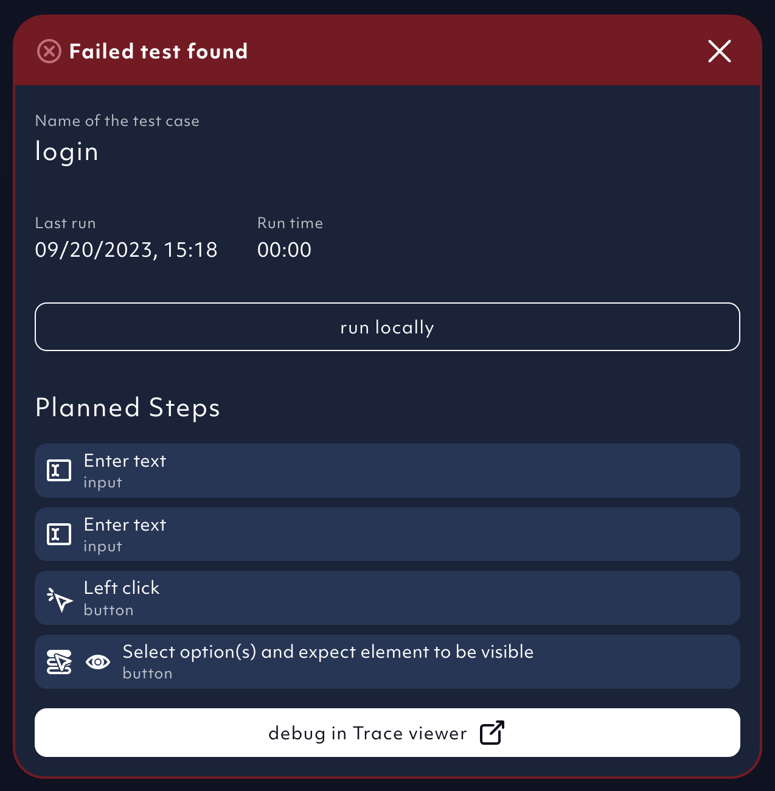
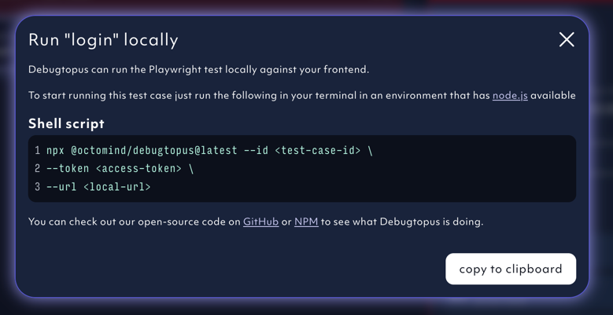
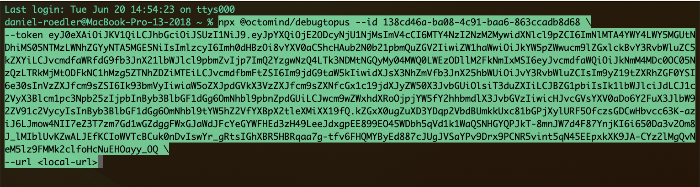
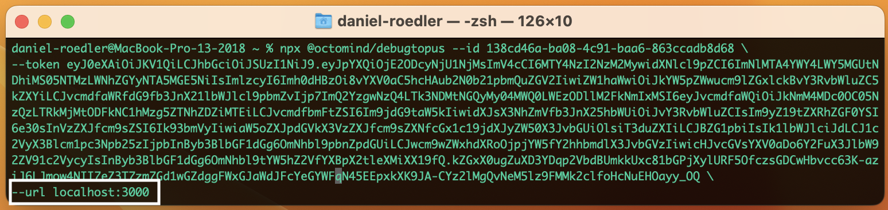
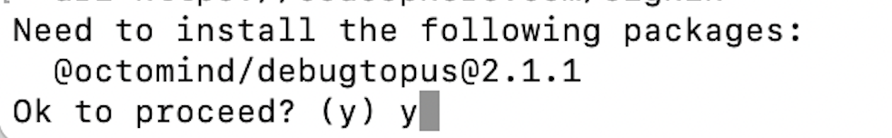
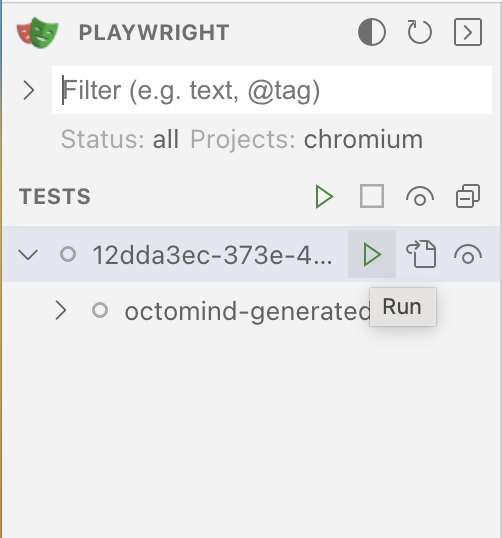
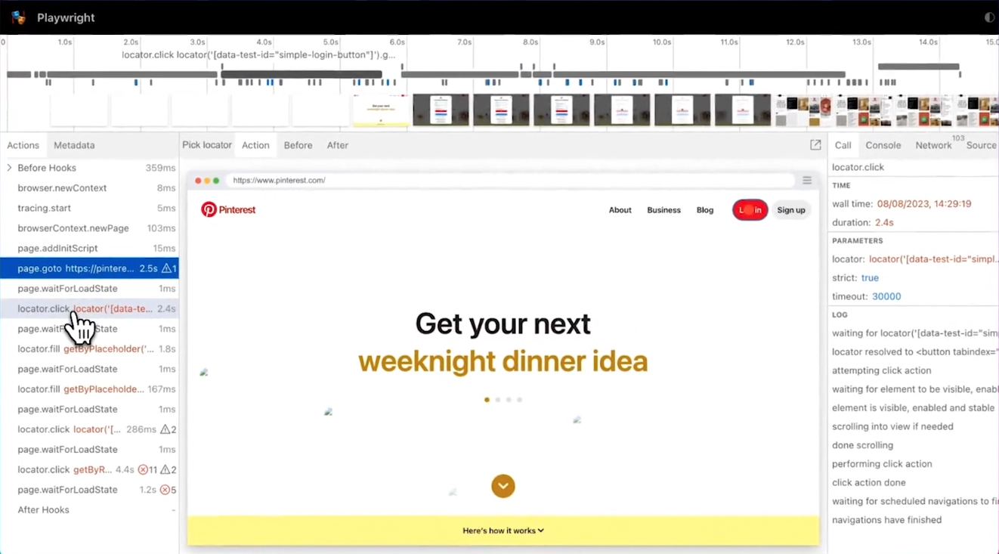

Debugtopus is our [open source tool](https://github.com/OctoMind-dev/debugtopus) enabling you to run tests locally for easier debugging. Follow the steps below to
execute a test case on your machine and against your local dev environment. This is good for setting breakpoints and
stepping through the code once our tests have identified an issue.

## 1. Get shell script

Click on `run locally` to get a shell script snippet which you can use to install and start Debugtopus.

<Frame caption="screenshot 02/2024">
  
</Frame>

Click on "copy to clipboard".

<Frame caption="screenshot 02/2024">
  
</Frame>

## 2. Start test locally

Open a terminal window and paste the shell script from your clipboard.

<Frame caption="screenshot 02/2024">
  
</Frame>

Now change the **url** with the url of your locally running application. In the example screenshot below,
the placeholder was replaced with _localhost:3000_. You might also have to include the route to the starting point.
For example, if your test case assumes to run from the sign-in page you have to add the route to the sign-in page
e.g. _localhost:3000/signin_.

<Frame caption="screenshot 02/2024">
  
</Frame>

## 3. First time users

If either Playwright or Chromium are not available on your computer, the shell script command will install
the Debugtopus package and its dependencies on your computer. You have to confirm by entering **y**.

<Frame caption="Install Debugtopus">
  
</Frame>

The biggest portion of this package is Playwright. If you want to see the full package list, please check out
the [Debugtopus Github repository](https://github.com/OctoMind-dev/debugtopus).

If you do not have Chromium installed, debugtopus will run **npx playwright install chromium** for you and the
first run will take some time to complete.

## 4. Run test locally

Click the `run` button which is displayed on the right side of the test case to run your test.

<Frame caption="Run test">
  
</Frame>

Now the Playwright UI is shown.

<Frame caption="Playwright UI screenshot">
  
</Frame>
