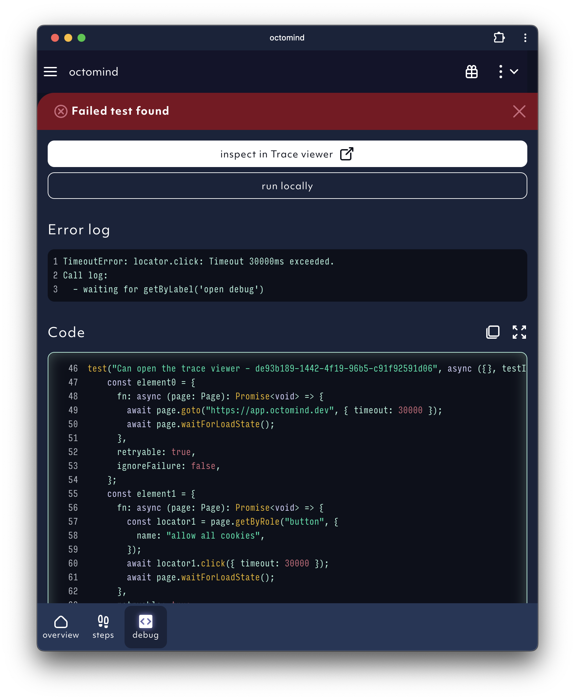
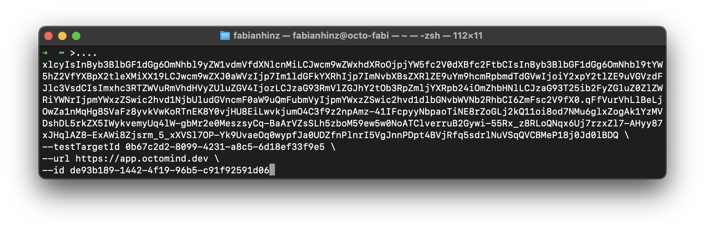
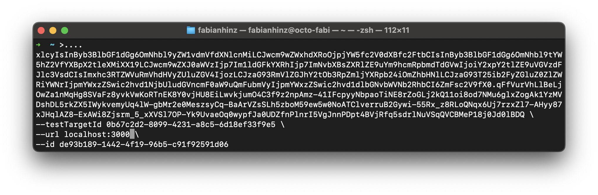

Debugtopus is our open source tool enabling you to run tests locally for easier debugging. Follow the steps below to run your tests locally.

## 1. Get shell script

Click on "run locally".

<Frame caption="Failed test case">
  
</Frame>

Click on "copy to clipboard".

<Frame caption="copy shell script">
  
</Frame>

## 2. Start test locally

Open a termninal window and paste the shell script from your clipboard.

<Frame caption="paste command from clipboard">
  
</Frame>

Now change the placeholder **local-url** with the url of your local environment. In the example screenshot below the placeholder was replaced with _localhost:3000_. You might also have to include the route to the starting point. If your testcase assumes to run from the sign-in page you might have to add the route to the sign-in page e.g. _localhost:3000/signin_.

<Frame caption="replace url placeholder with your local environment url">
  
</Frame>

Now the Playwright UI is shown.

<Frame caption="Playwright UI screenshot">
  
</Frame>

## 3. Run test locally

If either Playwright or Chromium are not installed on your machine yet, please check out the [First time users](debugtopus#3-run-test-locally) section.

Click the play button which is displayed on the right side of the test case to run your test.

<Frame caption="Run test">
  
</Frame>

## First time users

The shell script command will install the Debugtopus package and its dependencies on your computer. You have to confirm by entering **y**.

<Frame caption="Install Debugtopus">
  
</Frame>

The biggest portion of this package is Playwright. If you want to see the full package list, please check out the [Debugtopus Github repository](https://github.com/OctoMind-dev/debugtopus).

If you do not have Chromium installed, you will see the error message below after trying to run the test in Playwright.

<Frame caption="Install Chromium">
  
</Frame>

If this happens, please run the **npx playwright install** command from the screenshot in your terminal.
