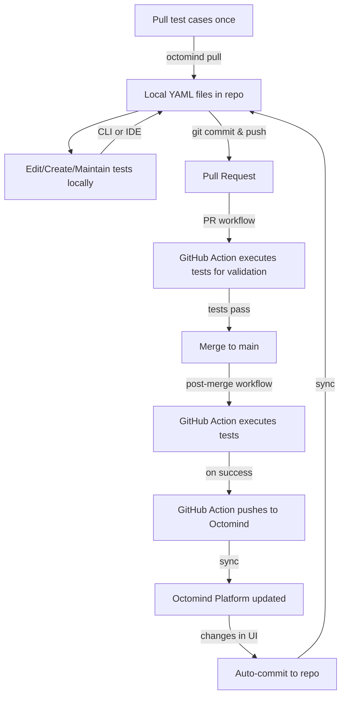

## Treat your tests like code

Dev mode brings your Octomind tests into your development workflow, enabling you to version control, edit locally, and sync automatically via CI/CD. Instead of managing tests exclusively through the Octomind UI, you can now work with them as code files in your repository—giving you the flexibility and control developers expect.

With dev mode, your test cases become part of your codebase. This means you can:

- **Version control your tests** alongside your application code
- **Review test changes** through pull requests with your team
- **Edit tests locally** using your preferred IDE and tools
- **Sync bidirectionally** between your repository and Octomind automatically
- **Track test evolution** through your Git history

### Getting started with dev mode

Dev mode works in three simple steps:

1. **Initialize**: Pull your current test cases from Octomind to your local repository
   ```bash
   octomind pull
   ```

2. **Commit**: Check the generated test files into your repository and manage them like any other code

3. **Automate**: Add the GitHub Action to enable bidirectional syncing on merge, ensuring your repository and Octomind stay in sync

Once set up, any changes you make to tests in your repository will automatically sync to Octomind when merged, and any updates made in the Octomind UI will be reflected in your repository. This creates a seamless workflow where your team can work with tests however they prefer.

## CI/CD integration for dev mode

If you've already [integrated Octomind into your CI/CD pipeline](/run-tests/execution-CI) to run tests on pull requests or branch deployments, enabling dev mode requires just one additional step: configuring your workflow to push test results back to Octomind after merge.

### The YAML files are your source of truth

In dev mode, the YAML test case files in your repository are the **single source of truth**. These files define your tests, and they are:

- **Executed** by the GitHub Action in your CI/CD pipeline
- **Pushed** back to the Octomind platform after successful execution
- **Synced** bidirectionally to keep your repository and Octomind in perfect alignment

This means any changes you make to the YAML files locally—whether through the CLI, your IDE, or any text editor—will be reflected in Octomind once they're merged and executed.

### Dev mode workflow

The complete dev mode workflow follows this cycle:



### Setting up the post-merge workflow

Assuming you already have a GitHub Action that runs tests on pull requests (see [CI/CD integration guide](/run-tests/execution-CI)), you need to add a similar workflow that runs **after merge to your main branch**.

Here's what your post-merge workflow should look like:

```yaml
name: Octomind Dev Mode Sync

on:
  push:
    branches:
      - main  # or your default branch

jobs:
  sync-tests:
    runs-on: ubuntu-latest
    steps:
      - name: Checkout code
        uses: actions/checkout@v4

      - name: Execute tests
        uses: OctoMind-dev/automagically-action-execute@v2
        with:
          url: <your-production-or-staging-url>
          token: ${{ secrets.OCTOMIND_API_KEY }}
          testTargetId: <your-testTargetId>

```

### Key differences from PR workflow

The main difference between your PR workflow and the dev mode sync workflow is:

| Aspect | PR Workflow | Post-Merge Workflow |
|--------|-------------|---------------------|
| **Trigger** | On pull request | On push to main branch |
| **Purpose** | Validate changes before merge | Execute and sync after merge |
| **Actions** | Execute tests only | Execute tests **and** push to Octomind |
| **URL** | Branch deployment URL | Production/staging URL |

### What happens during sync

When the post-merge workflow runs:

1. **Checkout**: Your repository code (including YAML test files) is checked out
2. **Execute**: The GitHub Action runs all tests defined in your YAML files against your specified URL
3. **Push**: Upon successful execution, the test definitions are pushed to Octomind, updating the platform with any changes from your repository

This ensures that your YAML files remain the authoritative source, while Octomind stays synchronized with your latest test definitions.

### Bidirectional sync

Dev mode supports bidirectional syncing:

- **Repository → Octomind**: Changes merged to your main branch are automatically pushed to Octomind
- **Octomind → Repository**: Changes made in the Octomind UI are automatically committed back to your repository

This means your team can work flexibly—some members can edit tests locally, while others can use the Octomind UI, and everything stays in sync.

<Tip>
  Start by pulling your tests once with `octomind pull`, then let the CI/CD automation handle all future syncing. You rarely need to run `octomind pull` again unless you want to manually sync changes.
</Tip>

<Warning>
  Make sure your GitHub Action has write permissions to push back to Octomind. You'll need to configure your `OCTOMIND_API_KEY` secret with the appropriate permissions.
</Warning>


