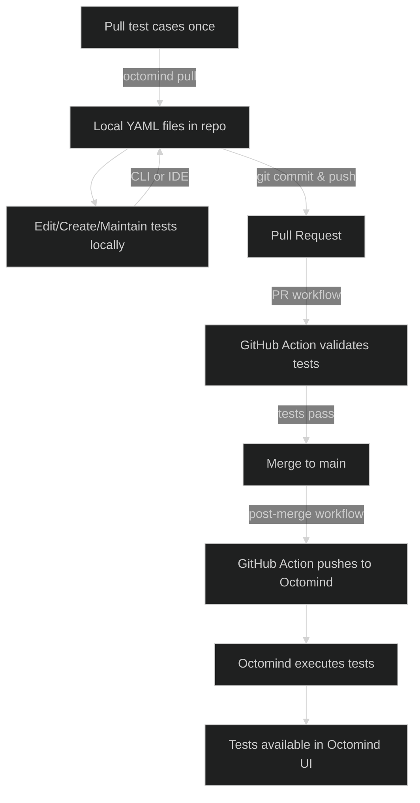

## Treat your tests like code

Dev mode brings your Octomind tests into your development workflow, enabling you to version control, edit locally, and sync automatically via CI/CD. Instead of managing tests exclusively through the Octomind UI, you can now work with them as code files in your repository—giving you the flexibility and control developers expect.

With dev mode, your test cases become part of your codebase. This means you can:

- **Version control your tests** alongside your application code
- **Review test changes** through pull requests with your team
- **Edit tests locally** using your preferred IDE and tools
- **Sync bidirectionally** between your repository and Octomind automatically
- **Track test evolution** through your Git history

### Getting started with dev mode

Dev mode works in three simple steps:

1. **Initialize**: Pull your current test cases from Octomind to your local repository

   ```bash
   octomind pull
   ```

   This creates a `.octomind` directory with your test cases as YAML files. [Learn more about the pull command →](/dev-mode/commands#pull)

2. **Commit**: Check the generated test files from the `.octomind` directory into your repository and manage them like any other code

3. **Automate**: Add the GitHub Action to enable bidirectional syncing on merge, ensuring your repository and Octomind stay in sync

Once set up, any changes you make to tests in your repository will automatically sync to Octomind when merged, and any updates made in the Octomind UI will be reflected in your repository. This creates a seamless workflow where your team can work with tests however they prefer.

## CI/CD integration for dev mode

If you've already [integrated Octomind into your CI/CD pipeline](/run-tests/execution-CI) to run tests on pull requests or branch deployments, enabling dev mode requires just one additional step: configuring your workflow to push test results back to Octomind after merge.

### The YAML files are your source of truth

In dev mode, the YAML test case files in your repository are the **single source of truth**. These files define your tests, and they are:

- **Pushed** to the Octomind platform via the GitHub Action
- **Executed** on the Octomind platform after being pushed
- **Managed** in your repository using version control

This means any changes you make to the YAML files locally—whether through the [CLI commands](/dev-mode/commands), your IDE, or any text editor—will be reflected in Octomind once they're merged and pushed.

### Example test case YAML

Here's what a test case looks like as a YAML file in your `.octomind` directory:

```yaml
# yaml-language-server: $schema=https://app.octomind.dev/schemas/SyncTestCaseSchema.json
id: 7eae5568-0f57-4f93-b8f1-aaf5a0bff6ab
description: Accept cookies
elements:
  - interaction:
      action: CLICK
    selectors:
      - selectorType: ROLE
        selector: button
        options:
          name: allow all cookies
    ignoreFailure: false
  - assertion:
      expectation: VISIBLE
    selectors:
      - selectorType: CSS
        selector: '[id="__next"]'
    ignoreFailure: false
runStatus: ON
entryPointUrlPath: ""
type: COOKIE_BANNER
prompt: Accept the cookies on the page.
version: "1"
```

The first line is a special comment that tells your IDE's YAML language server which schema to use for validation and autocompletion. [Learn more about IDE configuration →](/dev-mode/commands#editing-yaml-files-in-your-ide)

### Dev mode workflow

The complete dev mode workflow follows this cycle:



### Setting up the post-merge workflow

Assuming you already have a GitHub Action that runs tests on pull requests (see [CI/CD integration guide](/run-tests/execution-CI)), you need to add a similar workflow that runs **after merge to your main branch**.

Here's what your post-merge workflow should look like:

```yaml
name: Octomind Dev Mode Sync

on:
  push:
    branches:
      - main # or your default branch

jobs:
  sync-tests:
    runs-on: ubuntu-latest
    steps:
      - name: Checkout code
        uses: actions/checkout@v4

      - name: Execute tests on Octomind
        uses: OctoMind-dev/automagically-action-execute@v2
        with:
          url: <your-production-or-staging-url>
          token: ${{ secrets.OCTOMIND_API_KEY }}
          testTargetId: <your-testTargetId>
```

### Key differences from PR workflow

The main difference between your PR workflow and the dev mode sync workflow is:

| Aspect      | PR Workflow                   | Post-Merge Workflow              |
| ----------- | ----------------------------- | -------------------------------- |
| **Trigger** | On pull request               | On push to main branch           |
| **Purpose** | Validate changes before merge | Push and execute after merge     |
| **Actions** | Execute tests only            | Push to Octomind **and** execute |
| **URL**     | Branch deployment URL         | Production/staging URL           |

### What happens during sync

When the post-merge workflow runs:

1. **Checkout**: Your repository code (including YAML test files) is checked out
2. **Push**: The YAML test definitions are pushed to Octomind, updating the platform with any changes from your repository
3. **Execute**: The tests are executed on the Octomind platform against your specified URL

This ensures that your YAML files remain the authoritative source, while Octomind stays synchronized with your latest test definitions.

### Working with UI changes

Dev mode uses YAML files as the single source of truth. When you create or modify tests in the Octomind UI, you need to manually add those changes to your Git repository. You have two options:

1. **Copy from YAML view**: In the Octomind UI, view the test case in YAML format and copy it to your local `.octomind` directory
2. **Pull changes**: Run [`octomind pull`](/dev-mode/commands#pull) to fetch all test cases from Octomind and update your local YAML files

Once you've added the changes to your repository and merged them, the CI/CD workflow will push them back to Octomind, keeping everything synchronized.

<Tip>
  The workflow is: **Repository → Octomind** via CI/CD automation. Changes made
  in the UI need to be manually pulled back to your repository to maintain YAML
  as the source of truth. See [Dev Mode Commands](/dev-mode/commands) for
  detailed information on `pull`, `push`, `execute-local`, and `edit-test-case`
  commands.
</Tip>

<Warning>
  Make sure your GitHub Action has write permissions to push back to Octomind.
  You'll need to configure your `OCTOMIND_API_KEY` secret with the appropriate
  permissions.
</Warning>
