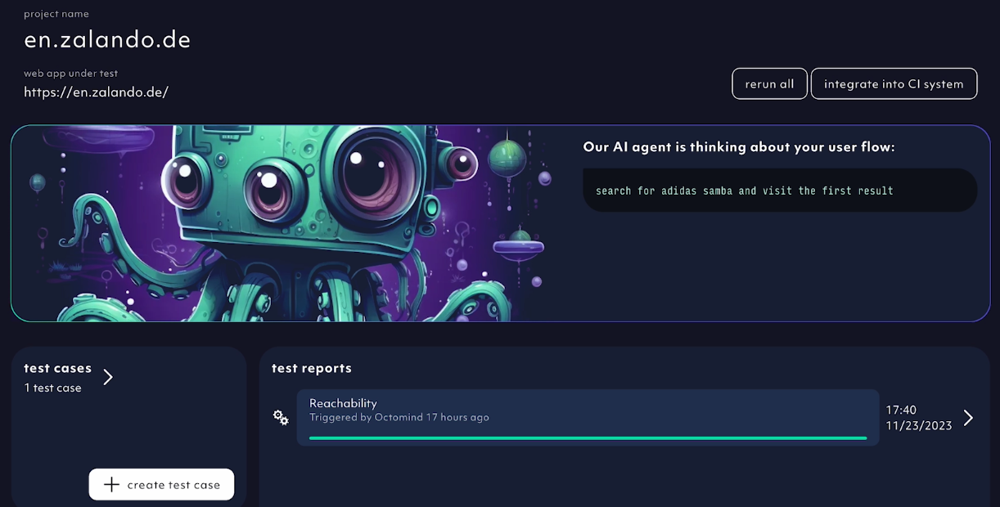
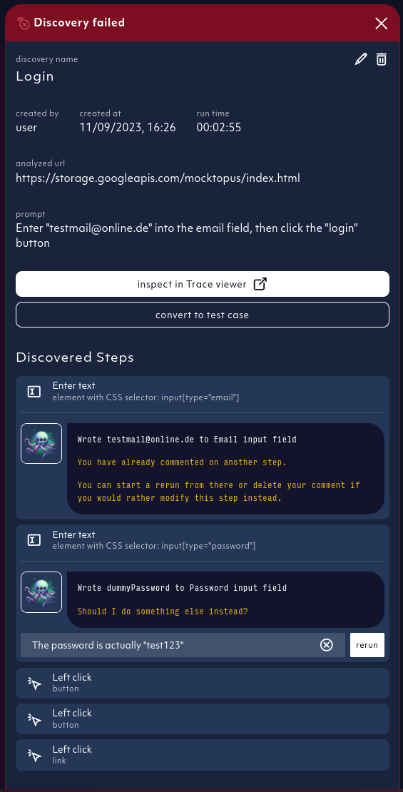
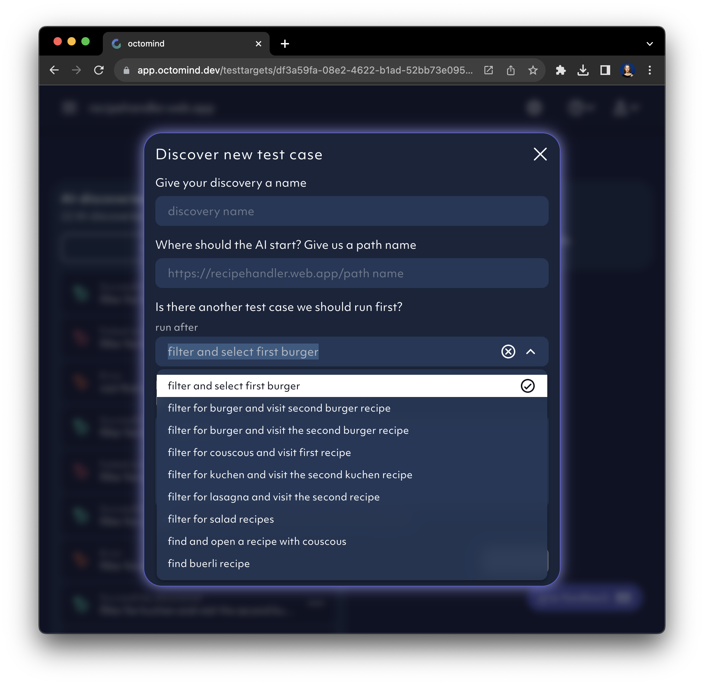

We are deploying an `AI agent` to discover user flows and interactions leading towards a desired user goal.
It is the foundation for creating `deterministic test cases`. We are recording and storing the interaction chain of a test case in an intermediate representation.
Playwright code is generated on the fly just before test execution.

## AI test case generation

We have released our free prompting interface for everyone to try it out as an alpha release. It will help us fine tune the AI agent and the self-serve experience.
[Sign up to our app](https://app.octomind.dev/setup/url?utm_source=docs&utm_medium=txt-lnk) and get the first UI test automatically.

While our `AI agent` discovers your test cases, it informs you about the progress it's making.

<Frame caption="AI agent informs about its progress, screenshot 11/2023">
  
</Frame>

### Editing your AI discovery

We've also added **human feedback** to the AI test case generation process. Pick the discovered step the AI agent got wrong and have it and the following steps rediscovered with a simple comment.

<Frame caption="Relaunch AI discovery based on your comments, screenshot 11/2023">
  
</Frame>

## Chaining your tests

When using the AI agent to discover your tests, you can use a dependency to chain them together. A user flow test case is virtually a chain of test cases. Shorter flows are faster, more specific and more reliable.

This is how you do it:

- Give us a path where the AI agent should start its discovery process.
- Select a test case that should run before the test AI agent is about to discover and run.

<Frame caption="Test case chaining for AI test case discovery, screenshot 10/2023">
  
</Frame>

<Info>
  The ultimate goal is to streamline the AI discovery process, so the initial
  test creation effort is minimal and test self-healing fully automated.
  Prompting will become fully automated for more and more test cases as we go.
</Info>

## Free prompting best practices - work in progress

1. Keep prompts short and to the point.
2. Mention all steps required, e.g. if you have to click away a cookie banner, mention it.

- Example without a cookie banner: “sign in with username and password using \{credentials\}”
- Example with a cookie banner: “accept cookies then sign in with username and password using \{credentials\}”

3. These are the limitations so far:

- We can only handle flows which happen inside the app. Cross-app or cross-device flows are not supported, e.g. we do not cover email confirmation flow or a 2FA right now.
- We cannot handle captchas yet.
- Our AI agent might get blocked by robot detection on some high traffic sites. Sites / apps in production are more bot-protected than staging / test systems.
- We are not able to stack test cases yet. We always start at 0. If your test case wants to add/remove devices from a list, you might have to include the sign-in procedure as well.
