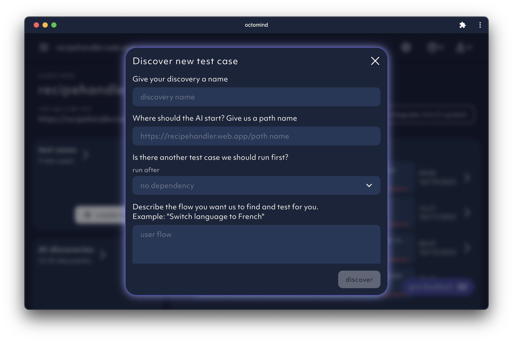
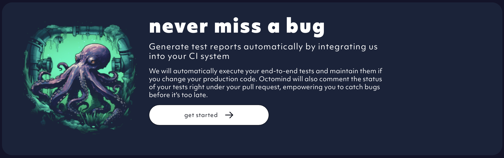

## 1. Give us a URL

We'll ask for a URL to create test cases. The URL has to be publicly accessible.

<Frame caption="First page of the setup flow - link to your website, screenshot 08/2023">
  
</Frame>

## 2. Name your project

The second page will render a screenshot of the url you provided. It tests that your URL is accessible. If it's not, you'll see an Octo in a jar.
Now you'd need to give your project a name. We'll propose one similar to the url you provided.
But you can choose your own one.

<Frame caption="Second page of the setup flow: Name your project, screenshot 08/2023">
  
</Frame>

<Frame caption="Second page of the setup flow - error page, screenshot 08/2023">
  
</Frame>

## 3. Give us a test user

Almost all web apps are featuring a sign-in and interesting test cases can only be executed after sign-in. This is why
we need a test user. Also, the first test case we will try to discover will be a sign-in with a username and a password.
The test credentials should fit the URL you provided above.

<Frame caption="Third page of the setup flow - test user credentials, screenshot 08/2023">
  
</Frame>

## 4. Create an account

Now we need to sign you up. Please, provide an email so we can get in touch.

<Frame caption="Fourth page of the setup flow - create account, screenshot 08/2023">
  
</Frame>

<Info>
  We are triggering a test case discovery for the sign-in flow right away. If it
  is successful, you will get your first test case within minutes. If the
  discovery fails, we will investigate. This might take a little longer.
</Info>

**For now, we will create additional test cases for you manually.** We will ask you for the most common cases and we'll create 3 to 8 of them.
We will notify you once we are done with the test case creation. Or you can try out our **brand new free prompting feature**!

## 5. BETA: Free prompt more test discoveries

We've added a new feature for creating test cases using free prompting. It's still in beta. Experiment and let us know your thoughts!
Ping us on [Discord](https://discord.gg/3ShnZMKRfA) or [drop us a note](mailto:contact@octomind.dev) via email.

<Frame caption="Free promting window for test case discovery, screenshot 08/2023">
  
</Frame>

## 6. Integrate Octomind into your CI

You'll get the best results by running the tests on pull requests.

<Frame caption="CI integration on the front page of the app, screenshot 08/2023">
  
</Frame>

If you are on [GitHub](/integrations/quickstart-GitHub) or on [Azure DevOps](/integrations/quickstart-Azure) you can use our pre-packaged integrations
from our [GitHub repositories](https://github.com/OctoMind-dev) to add Octomind to your CI/CD pipeline. You'll find all information in the respective
quickstart sections of this documentation. Start from the [integrations overview](/integrations-overview).

If you are on a different CI/CD pipeline, you'll have to use our API to trigger test cases. It should be possible to add custom scripts into
your pipeline. However, you won't be able to recieve test results directly in your pipeline. You'll have to review test runs directly in our app.

## 7. Get test results

You will receive test results directly in your CI/CD pipeline comments. Each test case will be listed with a deep link to test result details.
Please, have a look at the [Test results](/test-results) section of this documentation for more info.
