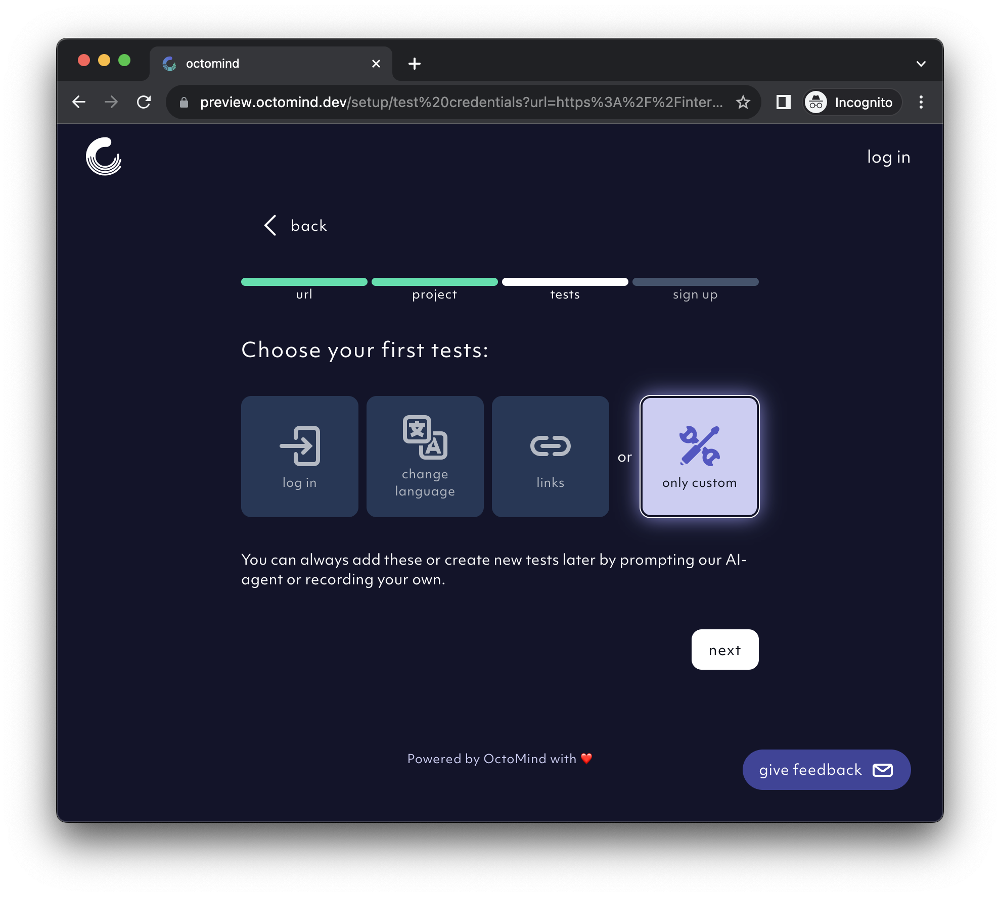

## 1. Give us a URL

We'll ask for a URL to create test cases. The URL has to be publicly accessible.

<Frame caption="First page of the setup flow - link to your website, screenshot 09/2023">
  
</Frame>

## 2. Name your project

The second page will render a screenshot of the url you provided. It tests that your URL is accessible.
Now, you need to give your project a name. We'll propose one similar to the url you provided.
But you can choose your own.

<Frame caption="Second page of the setup flow: Name your project, screenshot 09/2023">
  
</Frame>

## 3. Select test cases to be generated

During first set-up, you can select if we should auto-generate:

- a `log in` test for your web app
- a `change language` test
- a reachability check for all `links` on your page
- or just go with only custom test cases, where you can create test cases:
- with our `AI agent`
- with a `Playwright recording`
- `manually` by using our UI

<Frame caption="Third page of the setup flow - choose your first tests, screenshot 10/2023">
  
</Frame>

If you choose the `log in` test, we'll ask you for **test user credentials** \(test username and a password\).
The test credentials should fit the URL you provided above.

<Frame caption="Third page of the setup flow - insert test user credentials for a log-in test, screenshot 10/2023">
  
</Frame>

## 4. Create an account

Now we need to sign you up. Please, provide an email, so we can get in touch.

<Frame caption="Fourth page of the setup flow - create account, screenshot 08/2023">
  
</Frame>

## 4. Discover your test cases

Drafts of the test cases selected during sign-up can be found in the drafts section. Meanwhile, Octomind will discover test cases on your page according to how your website looks.

<Frame caption="Clicking this button will let our AI agent discover test cases, screenshot 02/2024">
  
</Frame>

## 5. Approve your test cases

Once our AI agent has finished discovery, you can approve or reject each individual draft to generate its steps.

<Frame caption="Approve or deny test cases that octomind discovered - screenshot 02/2024">
  
</Frame>

## 6. Publish your test cases

Once our AI agent has finished generating steps, you can publish the test case to disable editing and run it in your <a href="/test-reports">Test Reports</a>

<Frame caption="Publish your test case - screenshot 02/2024">
  
</Frame>
