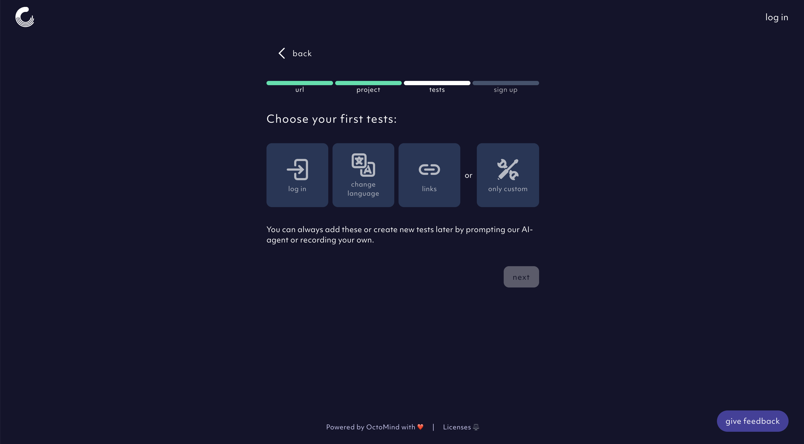
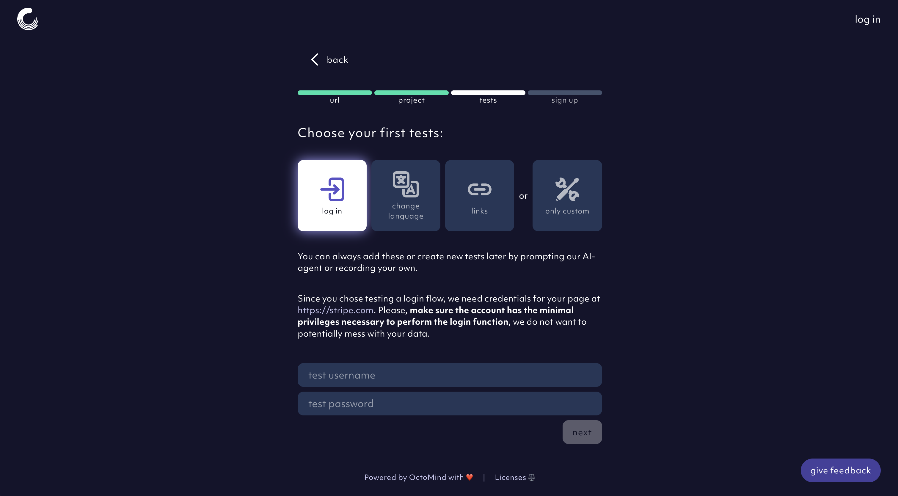
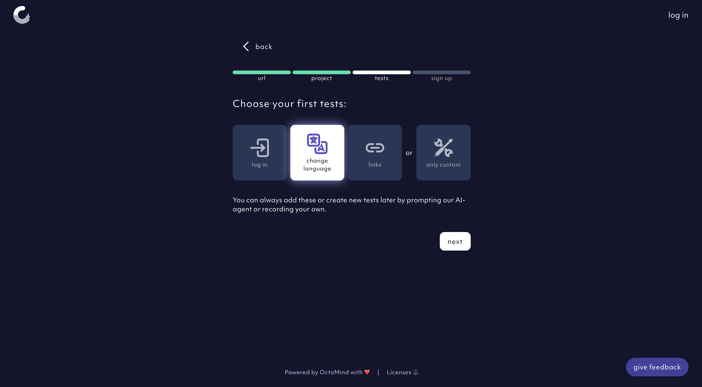
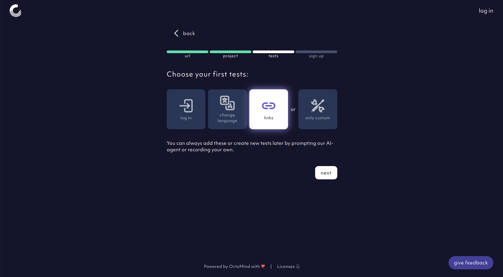
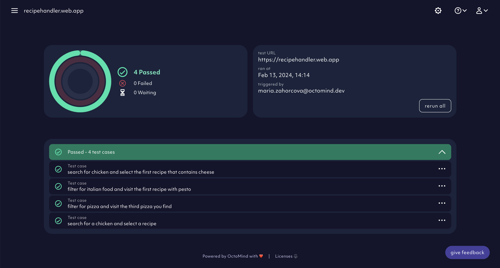

## 1. Give us a URL

We'll ask for a URL to create test cases. The URL has to be publicly accessible.

<Frame caption="First page of the setup flow - link to your website, screenshot 02/2024">
  
</Frame>

## 2. Name your project

The second page will render a screenshot of the url you provided. It tests that your URL is accessible. If it's not, you'll see an Octo in a jar.
Now you'd need to give your project a name. We'll propose one similar to the url you provided.
But you can choose your own.

<Frame caption="Second page of the setup flow: Name your project, screenshot 02/2024">
  
</Frame>

## 3. Select UI test cases to be auto-discovered

At the first set-up, you can select what should we auto-discover:

<Frame caption="Third page of the setup flow - choose your first tests, screenshot 02/2024">
  
</Frame>

**log in**
- this test assesses login functionality, verifying credential accuracy and security, to ensure a seamless and secure user access
- if you choose the log in test, we’ll ask you for test user credentials (test username and a password). The test credentials should fit the URL you provided above

<Frame caption="Third page of the setup flow - insert test user credentials for a log in test, screenshot 02/2024">
  
</Frame>

**change language**
- this test checks language switching functionality for smooth and accurate application localization

<Frame caption="Third page of the setup flow - change language test, screenshot 02/2024">
  
</Frame>

**links**

- this test verifies the accessibility of all links on the page, ensuring they are functional and lead to the correct destinations

<Frame caption="Third page of the setup flow - links test, screenshot 02/2024">
  
</Frame>

**only custom**
- note that a reachability test is always active by default. Selecting any test will execute it in conjunction with the
reachability test
- choosing the “only custom” option will run just the reachability test
- additionally, later in the application, you have the flexibility to conduct your own test regardless of the options previously selected

<Frame caption="Third page of the setup flow - insert test user credentials for a log-in test, screenshot 10/2023">
  
</Frame>

## 4. Create an account

Now we need to sign you up. Please, provide an email for confirmation. Following this, you will be redirected to a page to establish your account credentials.

<Frame caption="Fourth page of the setup flow - create account, screenshot 02/2024">
  
</Frame>

<Frame caption="Fourth page of the setup flow - create account, screenshot 02/2024">
  
</Frame>

<Frame caption="Fourth page of the setup flow - create account, screenshot 02/2024">
  
</Frame>

## 5. Enter application & Tutorial

If automatic redirection to our app does not occur after confirming your email, manually log in with the previously set credentials.
Welcome!

Upon logging in, a tutorial will be presented to you. We kindly recommend you **not to skip tutorial**, but it is up to you!

The tutorial provides essential guidance on how to **publish** your test case, created during the sign up process and
which is currently in draft form. Following publication, it will also instruct you on how to request a **test report**, which will lead to the presentation of your test results.

<Frame caption="Fifth page of the setup flow - the app welcome screen, screenshot 02/2024">
  
</Frame>

## 6. Test results

Through the completion of the tutorial, you will be guided to publish and report your first test, ultimately resulting in the provision of your test results.

<Frame caption="Sixth page of the setup flow - test results, screenshot 02/2024">
  
</Frame>
