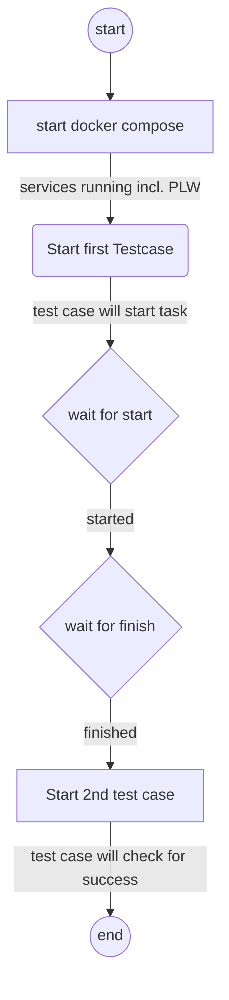

This is how you end-to-end test a user flow that involves a long running "background sequence" - a part of the flow that happens outside of the app the browser can't connect to. Imagine tasks that wait for a user to do something manually or outside physical systems that have to act or respond.

<iframe
  width="560"
  height="315"
  src="https://www.youtube.com/embed/Wtu41-VPOj0?si=hip8I2xaYs9RM0vw"
  title="YouTube video player"
  frameborder="0"
  allow="accelerometer; autoplay; clipboard-write; encrypted-media; gyroscope; picture-in-picture; web-share"
  referrerpolicy="strict-origin-when-cross-origin"
  allowfullscreen
></iframe>

When testing applications that involve long-running backend tasks, managing test execution efficiently is crucial. Instead of waiting for a single test to complete, a better approach is to split the test into two phases: **preparation** and **validation**. This allows for a structured and efficient workflow while leveraging **Octomind's CLI** for execution control.

## The two-phase testing approach

1. **preparation phase:** This phase initiates the long-running backend task. It sets up the necessary conditions and triggers the backend process without waiting for it to complete.
2. **validation phase:** After an appropriate waiting period, this phase verifies the results of the backend task to ensure correctness.

Using **Octomind's CLI**, we can trigger tests using tags to control execution. This allows us to specify which tests belong to the preparation phase and which belong to the validation phase.

## Setting up Octomind CLI

To use Octomind's CLI, install it via `npm`:

```bash
npm install -g @octomind/octomind
```

Then, set your Octomind API key for further use:

```bash
export APIKEY="<your_api_key>"
```

## Running the two-phase test

Test run will follow this flow:



### 1. Preparation phase: Trigger backend task

Set up a specific tag, for example - `preparation` - to run only the test cases that set up the environment and start the long-running task:

```bash
octomind execute --test-target-id <your_test_target_id> --tags preparation
```

This command will execute all tests associated with the `preparation` tag, ensuring that the backend task is triggered.

### 2. Validation phase: Check results

Once the backend task has had enough time to complete, run the validation tests using a different tag, let's say - `validation`.

```bash
octomind execute --test-target-id <your_test_target_id> --tags validation
```

This executes only the tests that check whether the backend task completed successfully and produced the expected results.

## Example: Testing a demo app

Let's consider a **demo application** that processes user data asynchronously. The preparation phase will trigger data processing, while the validation phase will check if the processing is complete. The see how this works we created such a demo app: https://github.com/sker65/orchestration-demo/.

It is written in **python** and uses **flask** and **celery**. Flask provides an API and a web UI, while celery provides background tasks. The application can be started using docker:

```bash
docker-compose up --build
```

The demo app **docker compose** also contains a [private location worker](/advanced/private-location) so that the local running app can be tested from Octomind's
cloud testing platform.

### Preparation: Start processing

```bash
octomind execute --test-target-id <demo-app-id> --tags preparation
```

This test case will use the web UI to start some background task.

### Wait for the background task to finish

After the test case execution is triggered we will use a bash script to monitor the progress. This is rather simple as we can just use the app's API to look for tasks and their status.

```bash
# function to wait for one of two states of a task
wait_for_task_state() {
    local target_state1=$1
    local target_state2=$2
    echo "Waiting for task state: $target_state1 or $target_state2..."

    while true; do
        response=$(curl -s $BASE_URL/tasks)
        if [ ! -z "$response" ] && [ "$response" != "[]" ]; then
            state=$(echo $response | jq -r '.[0].state')
            id=$(echo $response | jq -r '.[0].id')
            echo "Current state: $state ($id)"

            if [[ "$state" == "$target_state1" ]] || [[ "$state" == "$target_state2" ]]; then
                echo "Task reached state: $state"
                echo "Final state is: $state"
                break
            fi
        fi
        sleep 1
    done
}
```

### Validation: Verify processing completion

After the background tasks has finished, we validate:

```bash
octomind execute --test-target-id <demo-app-id> --tags validation
```

This could correspond to a check in the UI that ensures that there is a task with the state `success`.

## Conclusion

By splitting tests into **preparation** and **validation** phases and leveraging **Octomind CLI** with [tags](/get-started/manage-tests#tags), you can efficiently manage long-running backend tasks without unnecessary delays. This ensures a structured test execution strategy while keeping your CI/CD pipeline efficient and responsive.
