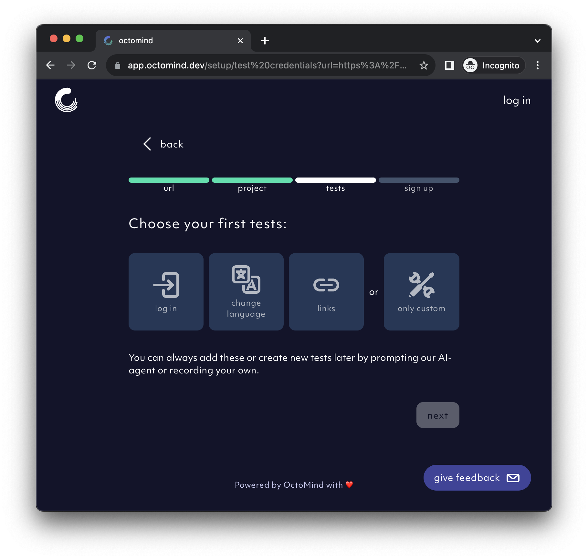

## Provide your website URL

You need to provide your website URL, Octomind begins the test only when it is able to access your UI. [Try it now](https://app.octomind.dev/setup/url?utm_source=docs&utm_medium=txt-lnk).

<Frame caption="First step of the setup flow where you enter your website URL">
  
</Frame>

## Choose what you want to test

When setting up, you can choose to perform:

- a **log in** test
- a **change language** test
- a reachability check for all **links** on your page
- a custom test where you create a test case using our [AI agent](/discovery) or `Playwright recording`, or by **manually** adding test case steps.  

<Frame caption="Second step of the setup flow where you choose test options you want to perform">
  
</Frame>

If your selected option requires log in access, you need to provide log in details of an existing user account that will be used during testing.

<Frame caption="Second step of the setup flow where you can create custom test case using our AI agent">
  
</Frame>

## Save setup and monitor progress

Octomind starts generating test cases after you save setup. Our `AI agent` provide updates while generating your test cases. 

<Frame caption="AI agent informs about its progress after you have completed setup">
  
</Frame>

## View test results in multiple platforms

We provide test results through multiple platforms. You can view test results on the Octomind web application or in your PR comments if you have integrated Octomind in your CI pipeline.   

<Frame caption="Example of Octomind test results in a Pull Request comment">
  
</Frame>

## Debug test results 

You can debug test results using [Playwright Trace Viewer](https://playwright.dev/docs/trace-viewer-intro) or Debugtopus, our open source tool that enables you to run tests locally.

<Frame caption="Example of Playwright Test Viewer">
  
</Frame>

<Frame caption="Set-up process for Debugtopus">
  
</Frame>
