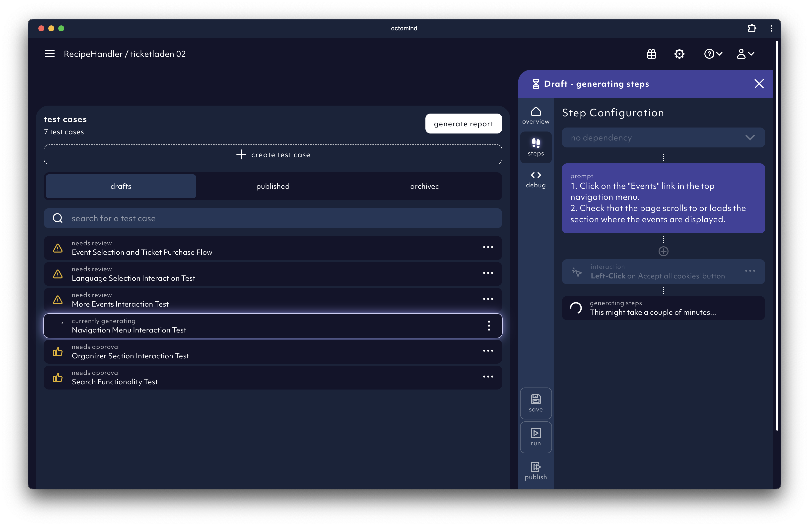
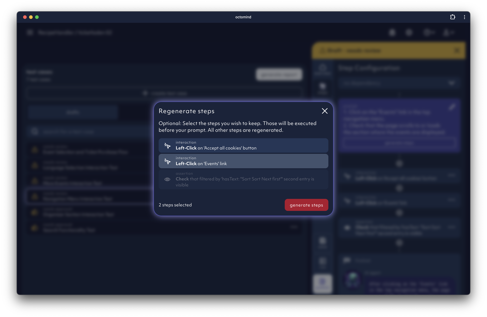
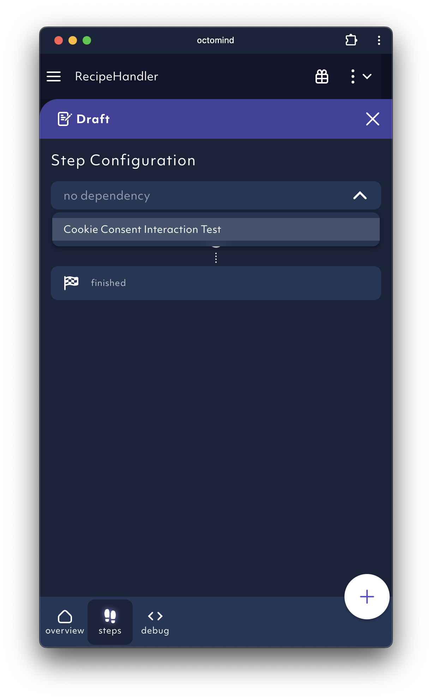
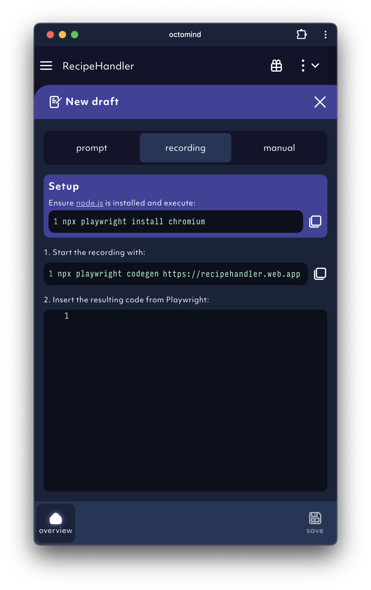
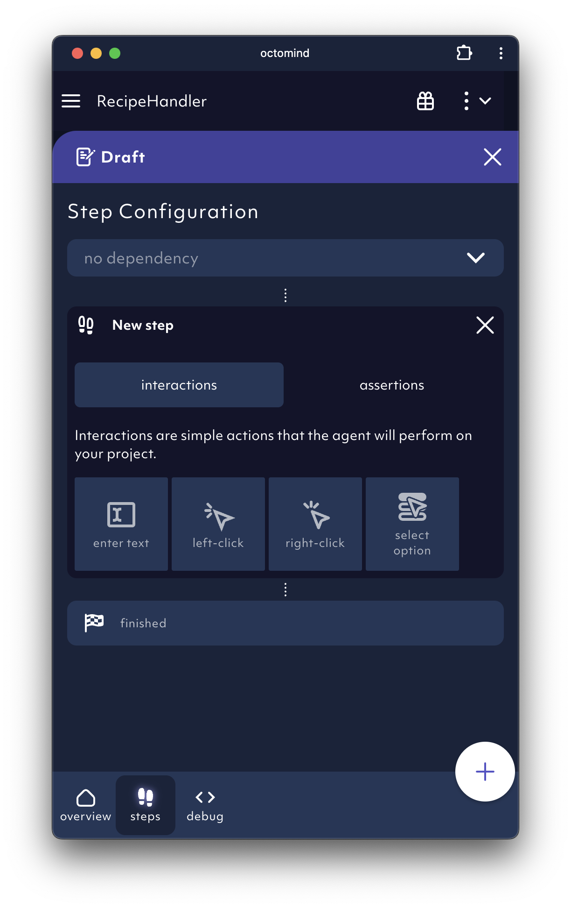

## prompting for test case generation

We are deploying an `AI agent` to find the interactions leading towards a desired user goal.
While our `AI agent` findes the steps of your test cases, it informs you about the progress it's making by showing the steps.

<Frame caption="AI agent informs about its progress, screenshot 02/2024">
  
</Frame>

### Editing your AI discovery

If the Agent went wrong, you can modify the prompt and decide which steps to keep. All subsequent steps are replaced with the new agent run.

<Frame caption="Relaunch AI discovery based on your comments, screenshot 02/2024">
  
</Frame>

### Chaining your tests

When using the AI agent, you can use a dependency to chain test cases together. A user flow is virtually a chain of test cases. Shorter flows are faster, more specific and more reliable.

This is how you do it:

- Give us a path where the AI agent should start its test case generation process.
- Select a test case that should run before the AI agent is about to run.

<Frame caption="Test case chaining, screenshot 02/2024">
  
</Frame>

### Free prompting best practices - work in progress

1. Keep prompts short and to the point.
2. Mention all steps required, e.g. if you have to click away a cookie banner, mention it.

- Example without a cookie banner: “sign in with username and password using \{credentials\}”
- Example with a cookie banner: “accept cookies then sign in with username and password using \{credentials\}”

3. These are the limitations so far:

- We can only handle flows which happen inside the app. Cross-app or cross-device flows are not supported, e.g. we do not cover email confirmation flow or a 2FA right now.
- We cannot handle captchas yet.
- Our AI agent might get blocked by robot detection on some high traffic sites. Sites / apps in production are more bot-protected than staging / test systems.

## record a test case

For more manual control and for cases that the AI model struggles with we are offering the option to put in code directly. Idealy produce your code with Playwright Codegen.
You can find the commands required to use Playwright Codegen directly in Octomind, ready for copy and paste.

Once you finished your recording, just copy and paste the whole code into the code field. It needs to be syntactically correct.

<Frame caption="Test case recording, screenshot 02/2024">
  
</Frame>

### Hint

- make sure to only record actions you actually want in your test case.
- we are not supporting all interactions. Clicks, key enteres and visibility assertions, however, are supported.

## manual test case creation

We also added a section to manually create test cases. You can add any number of interaction or assertions via the + icons.

<Frame caption="Test case manual creation, screenshot 02/2024">
  
</Frame>
