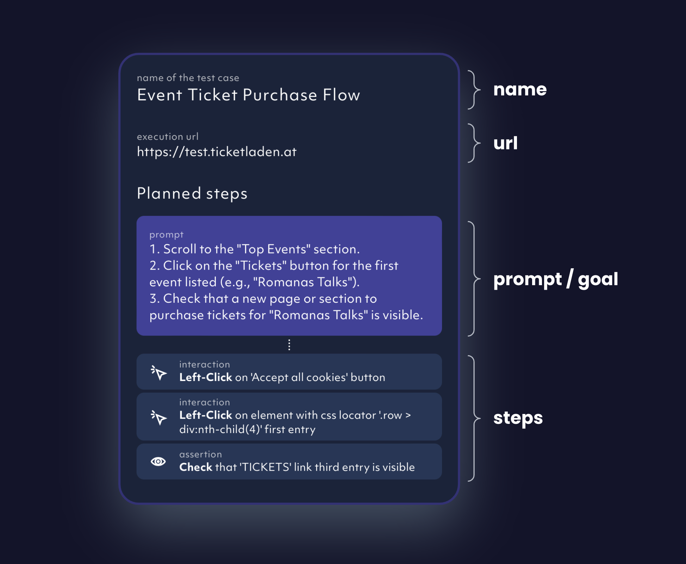
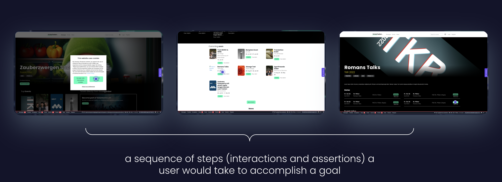

### Debugtopus

Debugtopus is our open source tool enabling you to run tests locally for easier debugging.

### Dependency

A test case can be dependent on another test case. This way code can be reused and test case generation gets much easier. Many
test cases can form a chain.

### Generate report

Generate report lets you run all published test cases. Test reports can be generated in many ways from in-app as well as through
CI commands or via command line.

### Manual test case creation

Manual test case creation is the process of creating a draft with no steps in it. Steps can be added manually after creation.

### Project

A [project](/projects) is a collection of test cases and test reports tied to a url (the test target).

### Prompt

The prompt is describing the goal the AI agent needs to achieve when generating the steps for a specific user flow.

### Recording

Recording is another way to add a new test case to Octomind. It is best used via Playwright Codegen and allows to paste code directly.

### Run locally

You can [run one or all test cases on your local machine](/debugtopus) against any test target.

### Run test case

You can run any draft or published test case by clicking the run button. This functionaility is intended to
validate the test case itself.

### Test case

A Test case is the Octomind base entity and it models a user flow.

<Frame caption="Anatomy of a test case, 03/2024">
  
</Frame>

A test case can have multiple states:

1. **draft:** test case ends up in draft state after being created. While a test case is in draft state, you can add/remove steps to fulfil your testing goal
2. **published:** once you're happy with your test case's steps, you can publish it. Published test cases will be included into test report
3. **archived:** A test case is archived once you click the remove button on a published test case.
   This excludes the test case from future test reports and we keep them as archived in case you change your mind

Draft and published test cases can be run to check out if they are working.

### Test report

The [test report](/test-reports) consists of the test results of all published test cases.

### Test step

A test step models minimal action within a test case, e.g. _click on a button_ (interaction) or _check if the
button is visible_ (assertion). We are supporting an ever growing number of interactions and assertions.

### Test result

A test result is an outcome of the execution of a single test case.
The test result can either be success `green` or failed `red`, depending if all interactions could be executed and if all assertions were met.
In rare cases the test result can also indicate an error `orange` which signals a problem on our side.

### User flow

A user flow is something a user would typically do in your web app. Examples would be to purchase a ticket for an event or
to book a hotel on a hotel booking page.

<Frame caption="example of a user flow, 03/2024">
  
</Frame>
