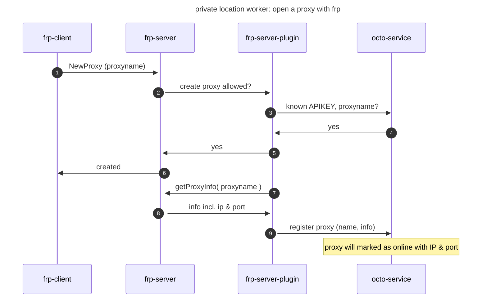
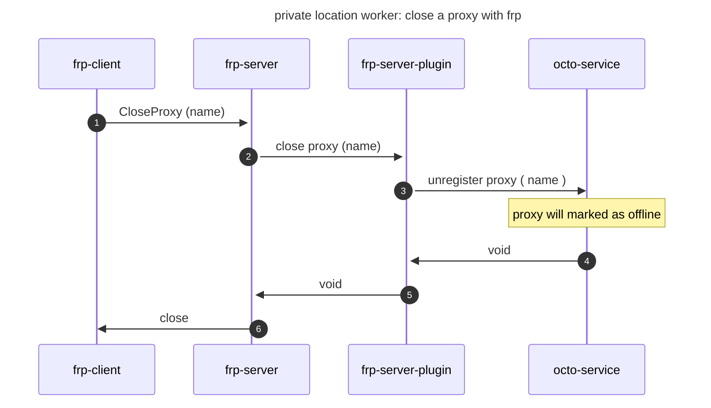

## Overview

<Frame caption="private location worker overview">
  
</Frame>

The Private Location Worker allows customers to include non-publicly available applications in Octomind discovery and test execution. It is run by the customer within their private network, enabling it to reach internal applications for testing.

The worker acts as a combination of a proxy and tunneling mechanism, connecting the private network with the Octomind platform. This feature ensures secure access to applications hosted behind firewalls or other private environments.

## Features

### Tunneling with FRP
- The tunneling is managed using [FRP](https://github.com/fatedier/frp), connecting the worker’s frp-client to Octomind’s proxy servers (EU or US).
- Requires access permission to specific public IPs: `35.192.162.70` or `34.159.153.198`.

### Access to Private Web Applications
- The embedded Squid proxy server allows requests from the private network, mimicking public proxy requests from within the customer’s network.
  
### Test Execution and Discovery
- After registering the worker with Octomind, users can configure the proxy location for executing discovery or test runs.

# usage

customer can run and build the private location worker on their premises using a container.

container image will be provided by octomind see [registry](https://eu.gcr.io/octomind-dev/plw:latest) or it can be build on your own see [below](#build)

to run the container a few environment variables are needed
## environment vars

- **APIKEY**: the octomind APIKEY for your organization
- **PLW_NAME**: name of the private locations worker as registered in the octomind platform (name must match)
- **PROXY_USER**: username for the (squid) proxy
- **PROXY_PASS**: password for the (squid) proxy
- **SERVER_ADDR**: the address of the server that the worker will connect (default: `35.159.153.198`)

The PROXY_USER and PROXY_PASS will protect your local proxy from authenticated access. When the worker starts it will register with the octomind platform and set the proxy user and pass, so that the octomind agent and test runner can of course use the proxy.

You can start as many private location worker as you like, but each must be registered by name with octomind first. The name must
be unique for your organization.

NYI: for scaling we will also support multiple instances of worker with the same name, but currently only one instance is supported.

## run

private location worker can simply run as docker container:
```
docker run --rm -e PLW_NAME=worker1 -e APIKEY=12345 -e PROXY_PASS=secret -e PROXY_USER=octo eu.gcr.io/octomind-dev/plw:latest
```

or use docker compose like this.

```yaml
services:
  private-location-worker:
    image: eu.gcr.io/octomind-dev/plw:latest
    environment:
      APIKEY: 1234
      PLW_NAME: worker1
      PROXY_USER: foo
      PROXY_PASS: bar
    restart: on-failure
```

## Security Considerations

- The container image is open-source, allowing customers to review and build their own versions. [GitHub Repository](https://github.com/OctoMind-dev/private-location-worker).
- Network access can be restricted to the tunnel server and test targets.
- The Squid proxy requires authentication, ensuring secure access. username and password is controlled by the customer.

## sequence on connect

## sequence on disconnect



## Additional Links
- [Two IP Addresses Documentation](https://octomind.dev/docs/data-governance/no-code-access#two-ip-addresses)
- [Quickstart Guide for API Key](https://octomind.dev/docs/integrations/quickstart-GitHub#1-create-an-api-key)
- [Github Fast Reverse Proxy](https://github.com/fatedier/frp)
- [Github Repository for Private Location Worker](https://github.com/OctoMind-dev/private-location-worker)
- [API Ref: register a private location](https://octomind.dev/docs/api-reference/register-a-private-location)
