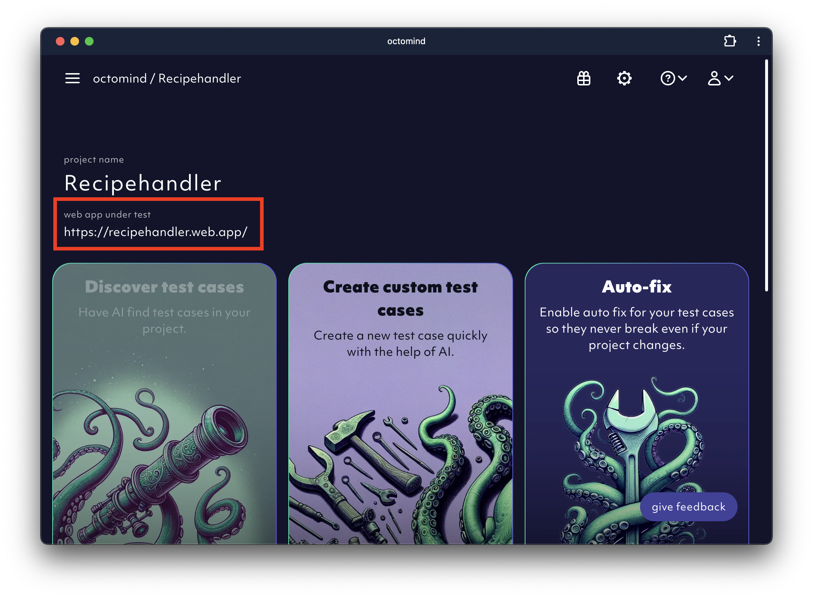
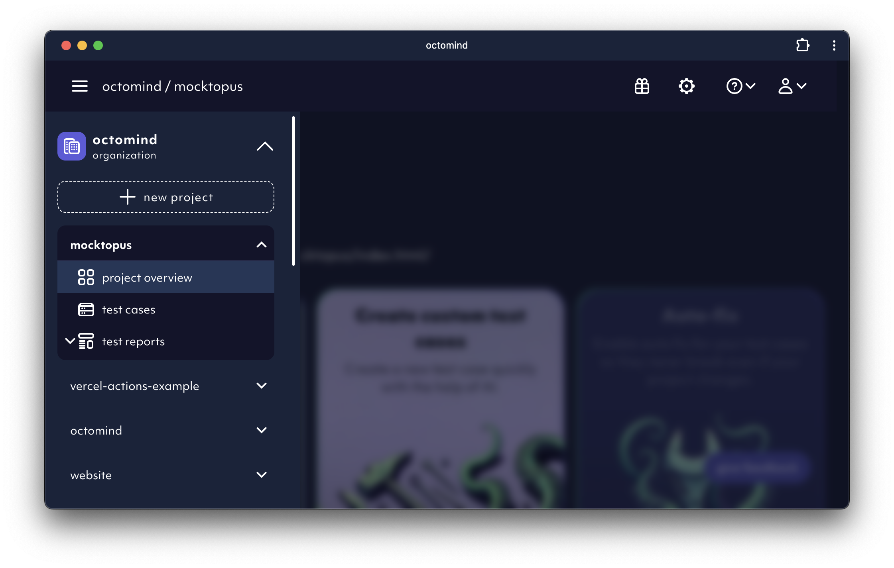
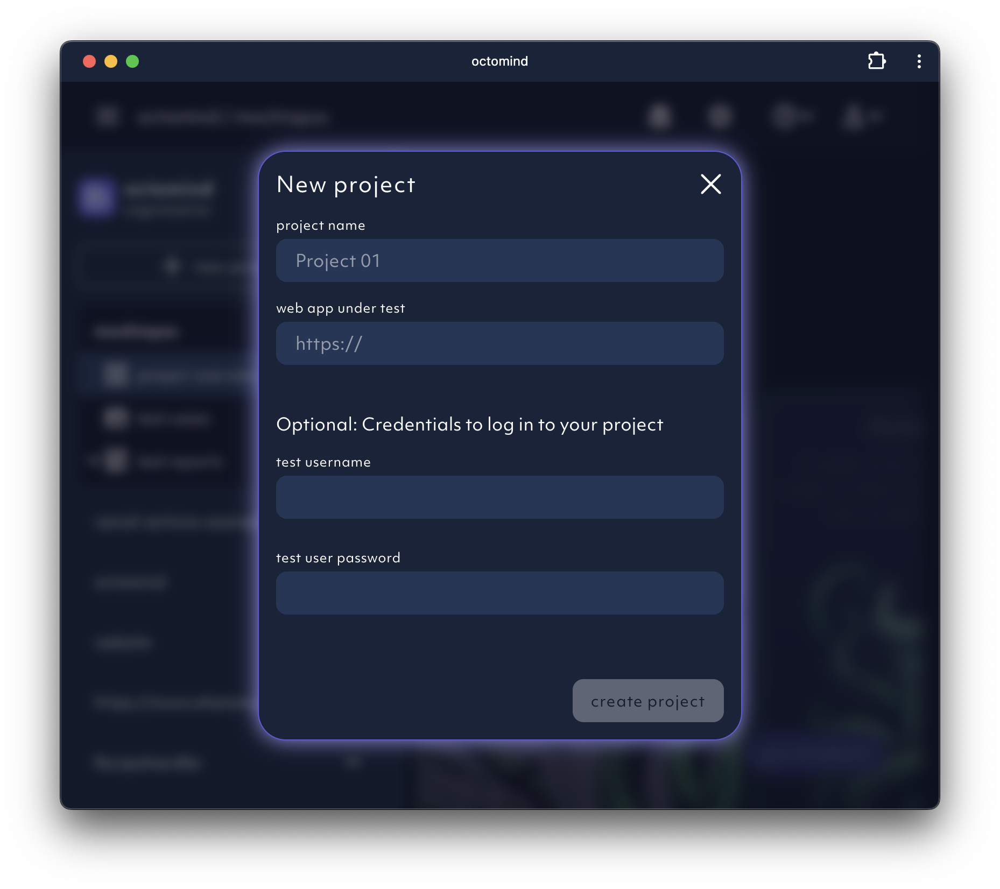

A project is a collection of test cases and test reports tied to a url, the test target. The URL is used as a base for every
further action within the Octomind app and you can extend it for a specific path (e.g. /docs) as a start URL for a specific test.

<Frame caption="test target url, screenshot 03/2024">
  
</Frame>

Projects are listed in the left menu bar underneath your organisation. The active project is shown in the top menu to the right
of the organisation.

<Frame caption="project list, screenshot 03/2024">
  
</Frame>

You can always create another project if you need to test multiple web sites. The tests won't be shared between them.

<Frame caption="new project dialogue, screenshot 03/2024">
  
</Frame>
