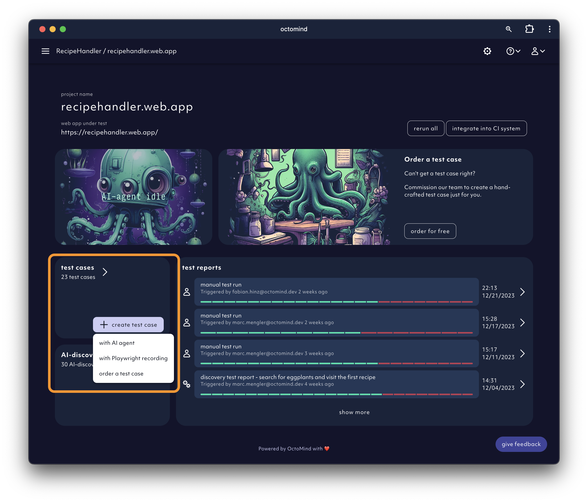
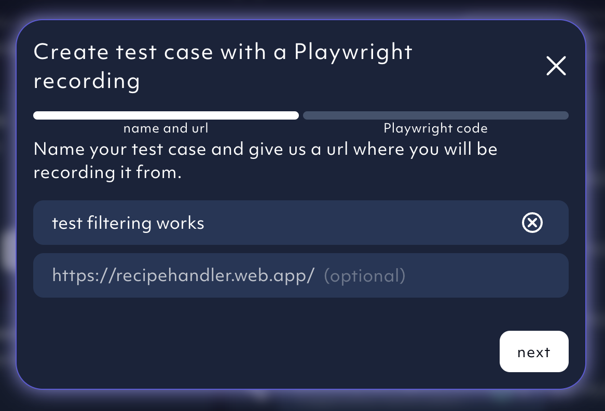
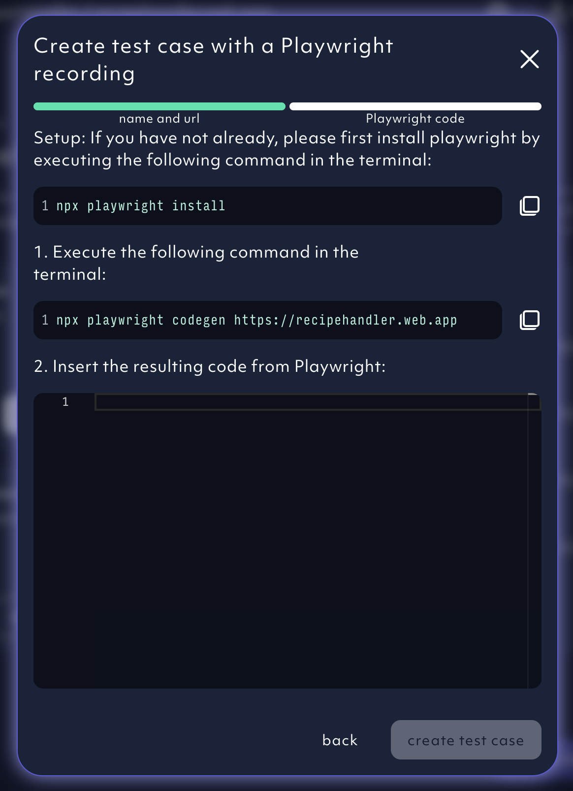
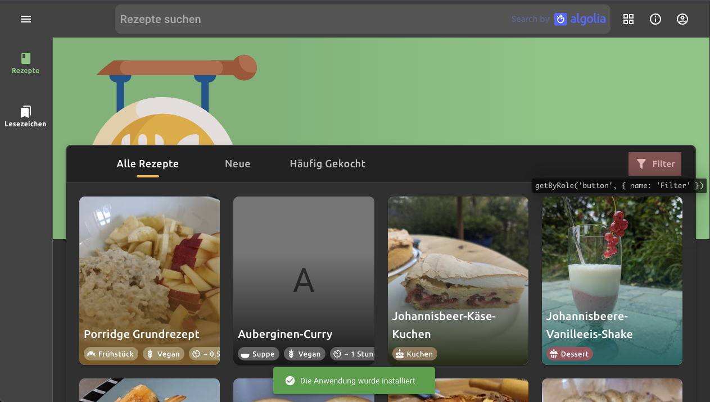
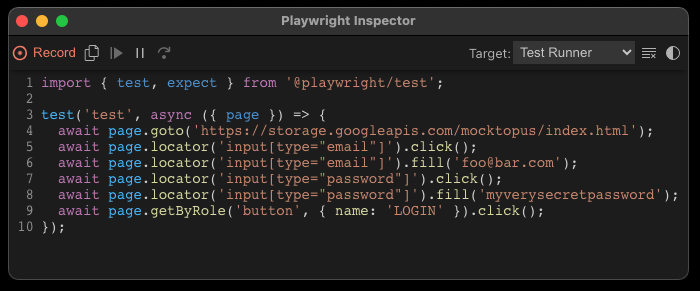
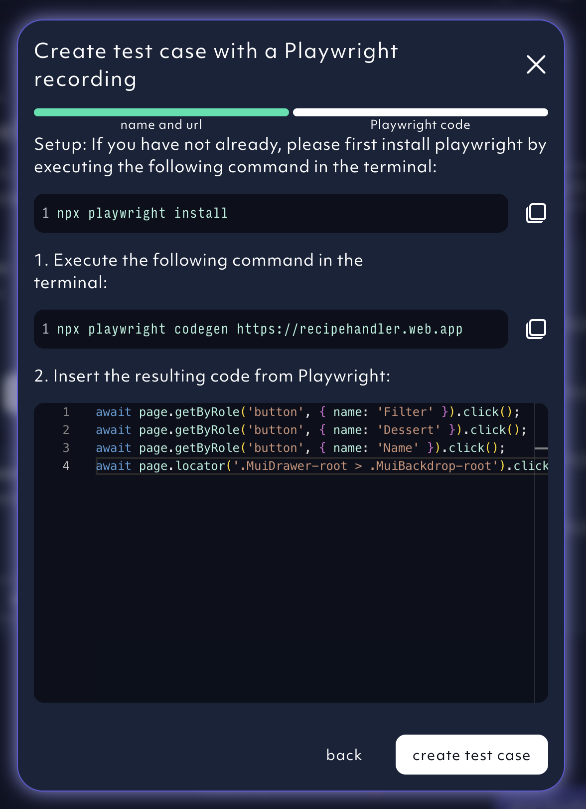
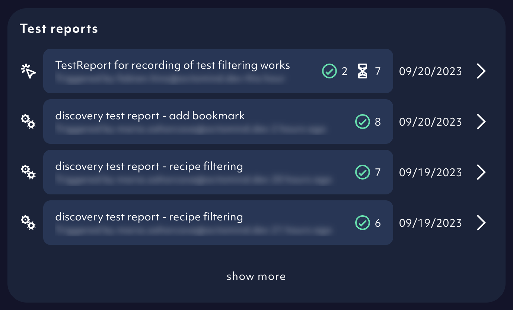

We heard you. You asked for a non-AI option to generate new test cases - for more manual control and for cases that the AI model struggles with.
[Playwright Inspector](https://playwright.dev/docs/codegen#generate-tests-with-the-playwright-inspector) is a helpful feature we used to create our test recorder.

It is a hacky version we are constantly fine tuning. Let us know your thoughts.

1. In your app home screen, click on `create test case` and select `with Playwright recording`.

<Frame caption="Home screen button to add test cases using Playwright recording, screenshot 01/2024">
  
</Frame>

2. Name your test case. Check if you are recording on the same url you registered with. Click `next`.

<Frame caption="Octomind test recorder - name test case, screenshot 09/2023">
  
</Frame>

3. Copy paste and execute the Playwright command in your terminal.

<Frame caption="Octomind test recorder - Playwright codegen command, screenshot 09/2023">
  
</Frame>

4. Playwright Inspector and your app are launched in separate browser windows.

Now, you can click yourself through the user flow. When you finish recording your test, stop the recording.

<Frame caption="Playwright opened a browser window with the project url, screenshot 09/2023">
  
</Frame>

5. Copy all the `await` lines of code except the `await page.goto` line.

Playwright generates the code for the user interactions which you can see in the Playwright Inspector window.

<Frame caption="Playwright Inspector recorded performed actions and generated test code, screenshot 09/2023">
  
</Frame>

6. Back to Octomind app. Insert the copied lines of code. Click `create test case`.

<Frame caption="Octomind test recorder - test code is inserted, screenshot 09/2023">
  
</Frame>

7. The test case has been executed and the test report added to your list.

<Frame caption="Test report from the recorded test added, screenshot 09/2023">
  
</Frame>
