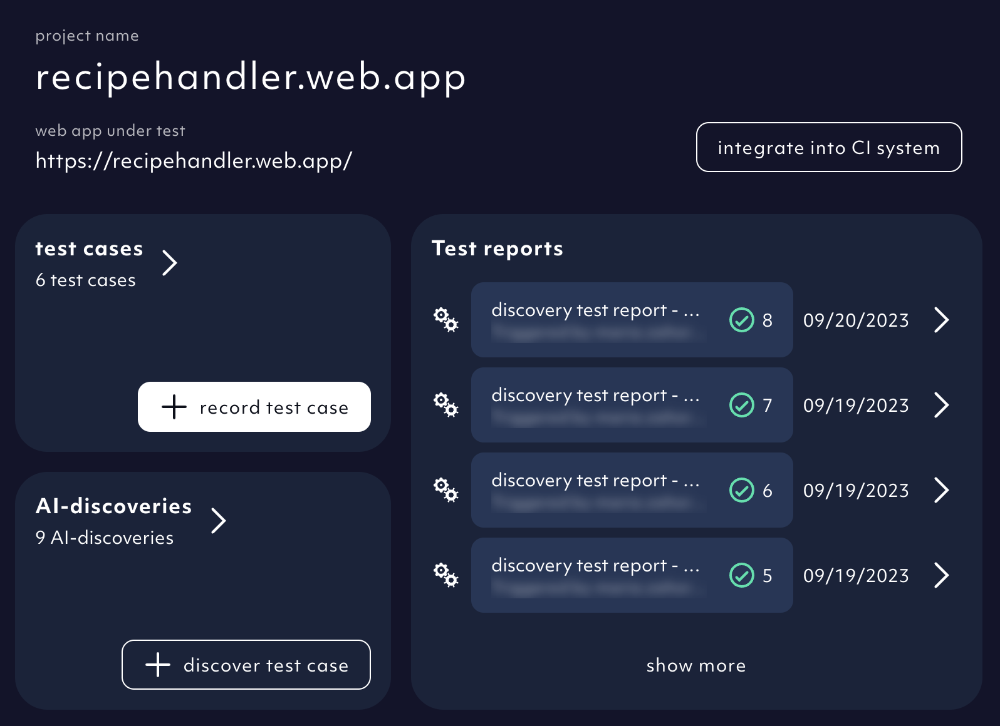
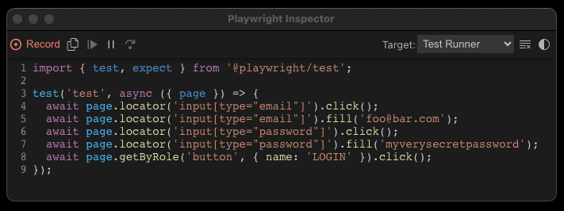
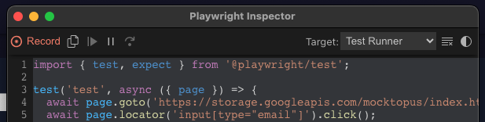

We heard you. You asked for a non-AI option to generate new test cases - for more manual control and for cases that the AI model struggles with.
[Playwright Inspector](https://playwright.dev/docs/codegen#generate-tests-with-the-playwright-inspector) is a helpful feature we used to create a test recorder.

A hacky version we are constantly fine tuning. Let us know your thoughts.

1. In your app home screen, click on `record test case`.

<Frame caption="Home screen button to add test cases using a test recorder, screenshot 09/2023">
  
</Frame>

2. Name your test case. Click `next`.

<Frame caption="Octomind test recorder - name test case, screenshot 09/2023">
  
</Frame>

3. Copy paste and execute the Playwright command in your terminal.

<Frame caption="Octomind test recorder - Playwright codegen command, screenshot 09/2023">
  
</Frame>

<div class="mt-8" />

<Warning>
  If you do not have Playwright installed, please install it first.
</Warning>

```
npx playwright install
```

4. Playwright Inspector and your app are launched in separate browser windows.

Now, you can click yourself through the user flow. When you finish recording your test, stop recording.

<Frame caption="Playwright opened a browser window with the project url, screenshot 09/2023">
  
</Frame>

5. Copy only the `await` lines of code to clipboard.

Playwright generates the code for the user interactions which you can see in the Playwright Inspector window.

<Frame caption="Playwright Inspector recording performed actions, screenshot 09/2023">
  
</Frame>

<div class="mt-8" />

<Warning>
  We do not support `goto` statement at the moment. If Playwright recorded it,
  please, leave the line out when copying.
</Warning>

<Frame caption="Playwright Inspector recording an action with goto, screenshot 09/2023">
  
</Frame>

6. Back to Octomind app. Insert the copied lines of code. Click `create test case`.

<Frame caption="Octomind test recorder - test code is inserted, screenshot 09/2023">
  
</Frame>

7. The test case has been executed and the test report added to your list.

<Frame caption="Test report from the recorded test added, screenshot 09/2023">
  
</Frame>
