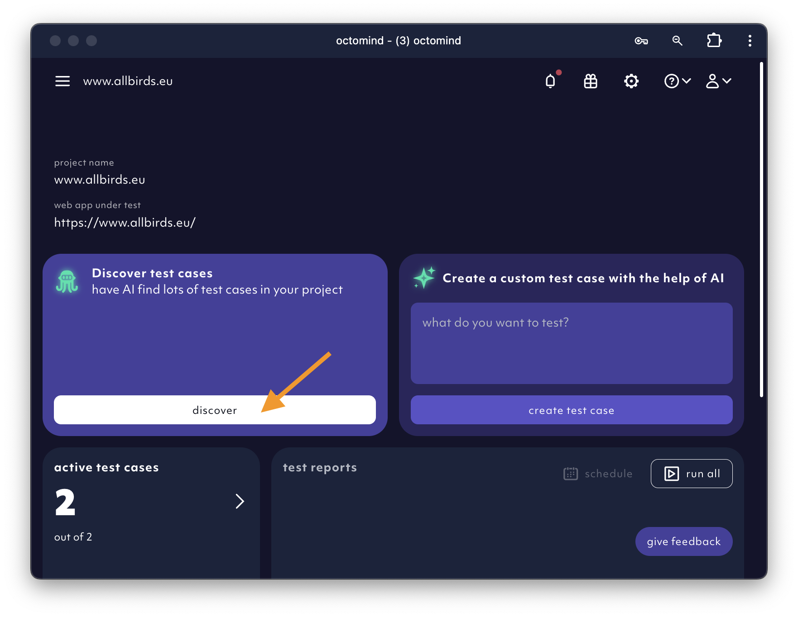
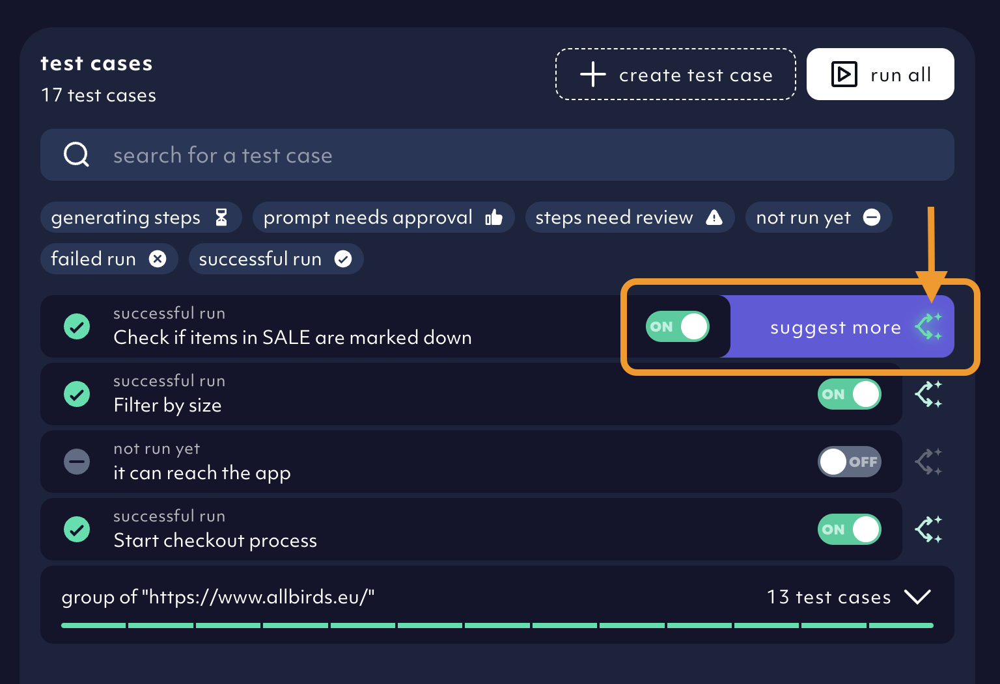
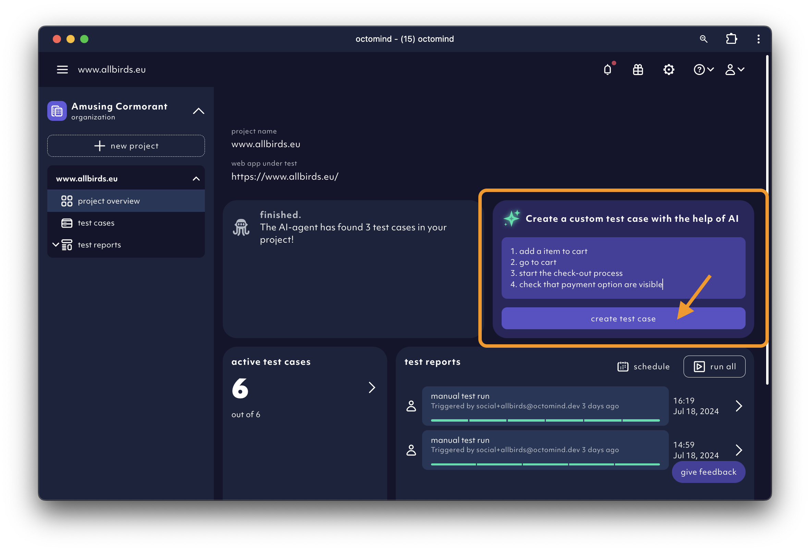
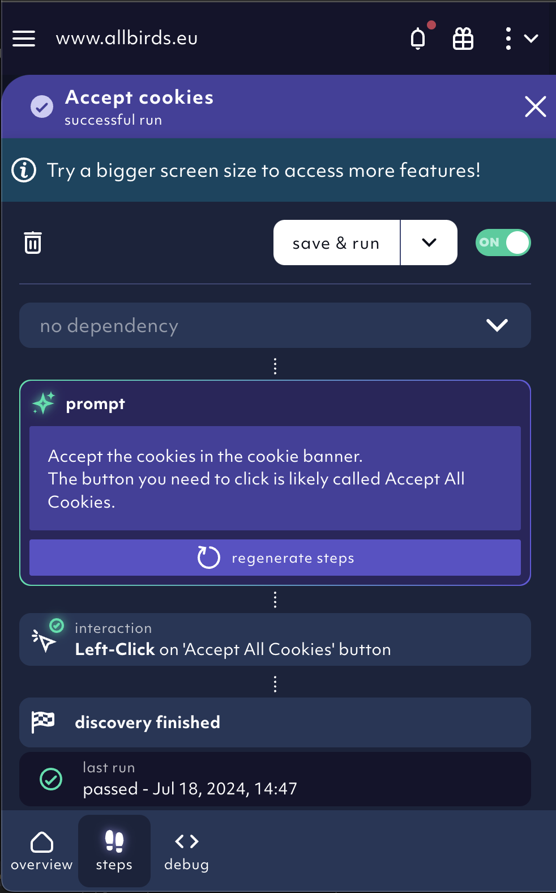
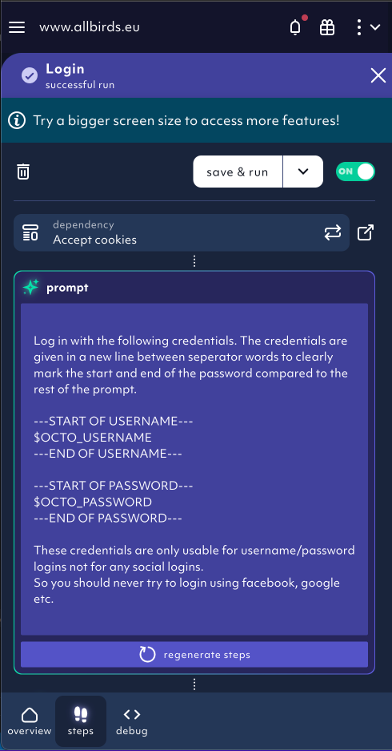
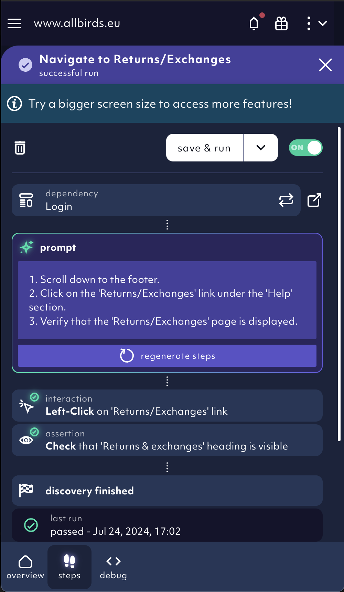
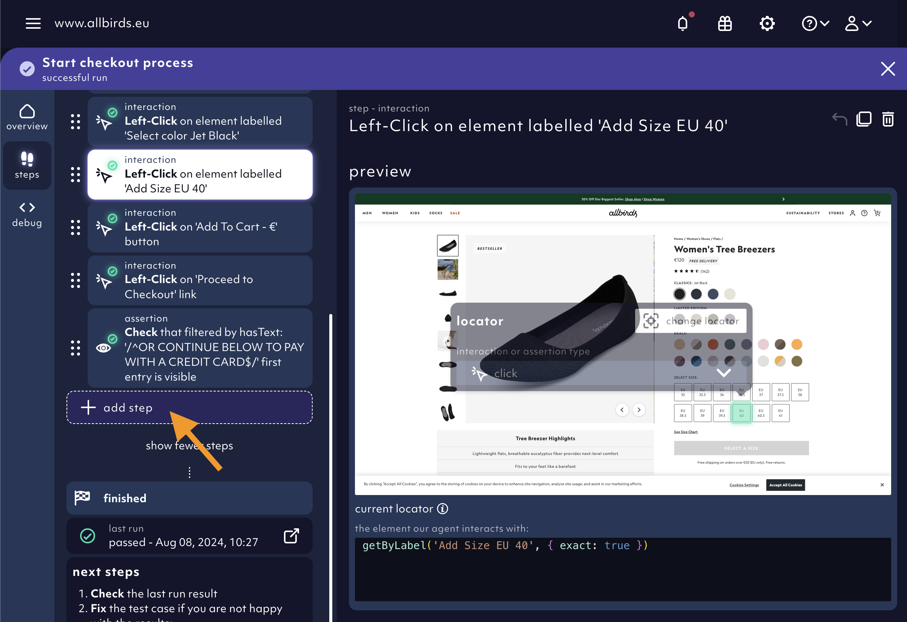
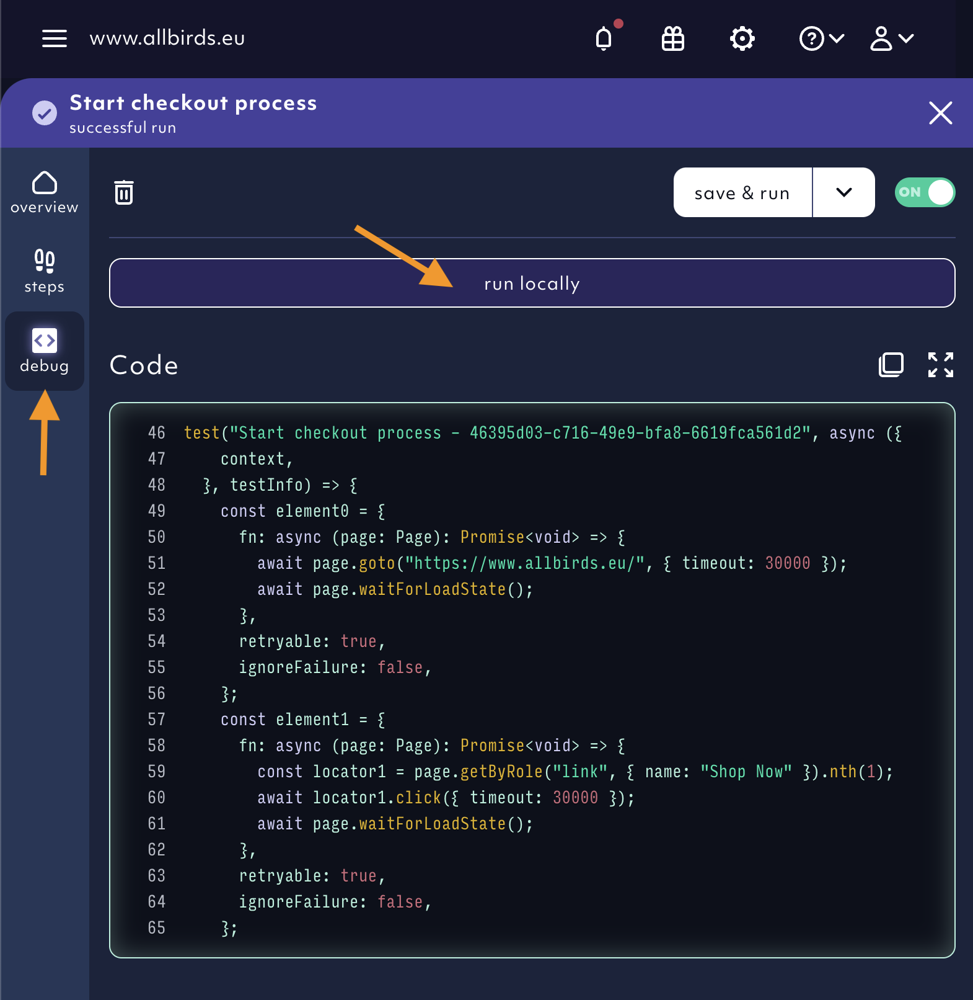
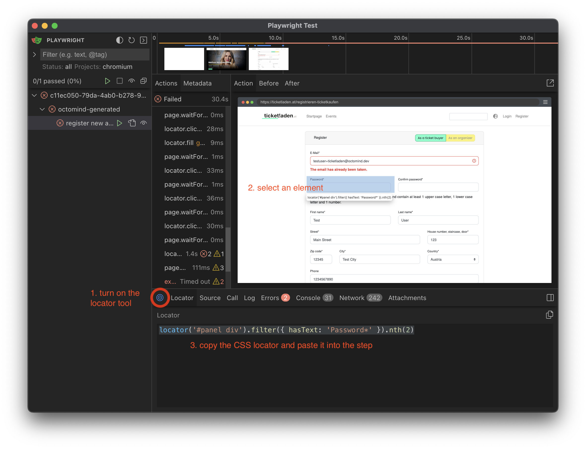

## Tl;dr:

- start with auto-discovery
- have AI agent suggest more test cases
- create more tests with a prompt
- use `dependencies`
- help the AI agent where it went wrong
- use `run locally` and `Playwright Codegen`
- work on multiple test cases in parallel

## Start with the AI auto-discovery

Always use the `Discover` button on the overview page. It gives you a head start with up to 3 AI auto-discovered tests.

<Frame caption="Have AI discover first 3 test cases from overiew page, 07/2024">
  
</Frame>

You have have the AI agent auto-discover more test cases. Go into the test case and hover over the `suggest more` icon - a button will appear. Click on it. Find more on how `suggest more` works [here](/new-test-case).

AI agent will discover up to 3 new tests based on the one you started it from. The original test will be added as **dependency**. We will auto-generate steps for every discovered test case and validate them.

<Frame caption="Have the AI agent suggest more test cases, 08/2024">
  
</Frame>

<Info>

At sign-up, we automatically discover **close cookie banner** and **"required" login** test cases. These are often the necessary prerequsites for all other tests. [Learn more.](/first-steps#4-open-the-octomind-app-for-the-first-time)

</Info>

## Create more tests with a prompt

This comes in handy when you want a specific test the AI agent didn't discover. There are multiple ways to start with a prompt.

Use the `create test case` button on the **overview page** or on the **test cases** page.

<Frame caption="Create new test case from the overview page, 07/2024">
  
</Frame>

<Tip>

**Why should you start with AI?** All these techniques will give you a couple of test cases to get started with almost no effort.

</Tip>

## Use dependencies

Best practice is to keep the test cases short and to the point. Ideally, each test case represents a small task you want to achieve.

What if you want to test if a full user flow is working? A good method for this is **test chaining** - the use **dependencies**.

Take **accept all cookies**, **login** and **open profile page**. Every test case runs in isolation and therefore needs to include the full flow. **Open profile page** would have to include steps for closing cookie banner and loggin in.

Unless you chain the tests together - make **accept all cookies** a dependency of **login** and make **login** a dependency of **open profile page**.

This way the test runner as well as the AI Agent are using pre-play to execute dependencies before starting their actual work.

<Frame caption="'accept cookies' test is first in the chain - it does not have a dependency, 08/2024">
  
</Frame>

<Frame caption="'login' test depends on 'accept cookies', 08/2024">
  
</Frame>

<Frame caption="'navigate to returns' test depends on 'login' test, 08/2024">
  
</Frame>

<Tip>
**Advantages of using dependencies**

- code is reused and only maintained in one place
- much shorter test cases are easier to understand and debug
- better chance of the AI agent being successful when generating test steps, it can focus on the main task

</Tip>

## Help the AI agent when it went wrong

We are constantly improving the AI agent but it still might make mistakes. Help it find its way. Use the `steps` tab to edit and fine tune your test.

You can add missing steps by clicking the `+ add step` button and choosing the desired **interaction** or **assertion**. Use the **virtual locator picker** to select the right `locator` in the snapshot on the right. Drag and drop the step where needed.

More details can be found in the [editing test cases](/edit-test-case) section.

<Frame caption="add missing steps, 08/2024">
  
</Frame>

<Tip>
  
  **Advantages of manual editing**

- Modifying steps much faster than changing the prompts and having the step AI auto-generated
- Our virtual locator picker, copy paste and drag & drop functionalities make it a smooth experience
- You have much more control over the outcome

</Tip>

## Run Octomind tests locally

`Run locally` is most helpful for step by step adjustments since it is giving you the current state of a page. It will noticeably speed-up your test creation efforts.

You can find the `run locally` button in the `debug` tab of your test case. Find out how to [run Octomind tests locally](/debugtopus).

<Frame caption="'run locally' in test detail view, 08/2024">
  
</Frame>

You can use the locator tool to easily receive locators. Activate it and click on the desired element.
Then you can copy the locator.

<Frame caption="Playwright locator tool when running locally, 02/2024">
  
</Frame>
