## General Principles

- start with a prompt
- use `dependencies`
- help the agent out if it went wrong
- use `run locally` and `Playwright Codegen`
- work on multiple test cases in parallel

## Start with a prompt

There are multiple ways to start with a prompt.

1. On sign-up choose as many test cases as possible from the catalogue (login, link checks, change language)

   <Frame caption="Select test cases on sign-up, screenshot 02/2024">
     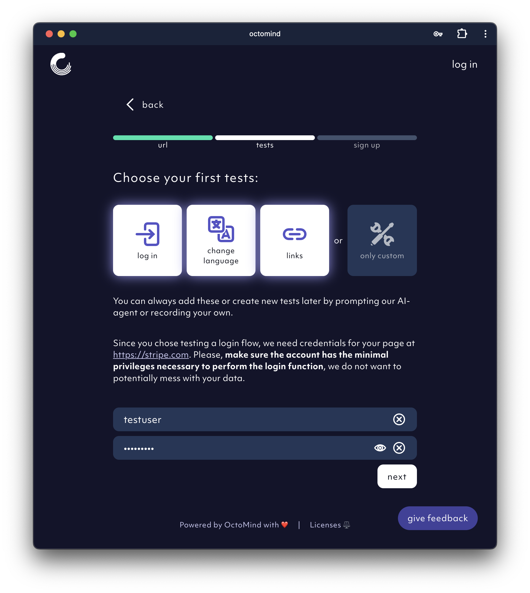
   </Frame>

2. Always use "Discover test cases" from the overview page. It gives you a head start.

   <Frame caption="Discover test cases from overiew page, screenshot 02/2024">
     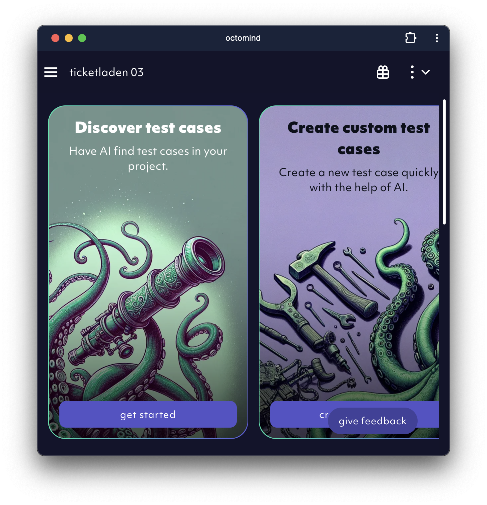
   </Frame>

3. Use "create custom test cases" from the overview page.
   <Frame caption="Start test case creation from the overview page, screenshot 02/2024">
     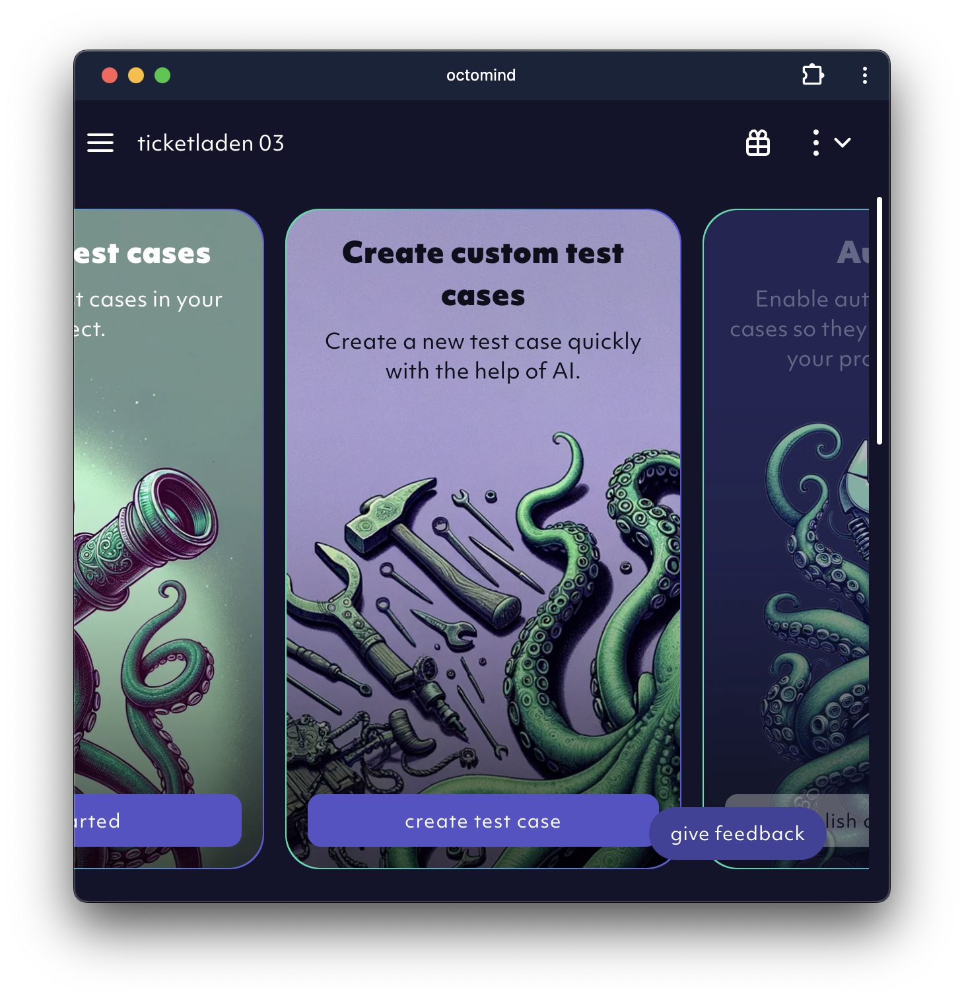
   </Frame>

The sign-up procedure also creates a test case to close the cookie banner, if applicable, as well as a login test case that typically enables the high value user flow tests that depend on it.

<Tip>

**Advantages of starting with AI**

- All these techniques will give you a couple of test cases to get started with
  with almost no effort.
- Test case generation runs in parallel and in the background.

</Tip>

## Use dependencies

Keep test cases short and to the point. Ideally each test case represents a small task you want to achieve. One technique to make this happen is using dependencies.
Typically the first test case you need is "accept all cookies". The second one is "login with username and password" and the third one might be "open profile page".
The second test case would have to take care of cookies during its execution. The third test case would have to take care of cookies and login.
This is because every test case runs in isolation and therefore always needs to include the full flow.
This is where dependencies - or test case chaining - gets really valuable.
Make "accept all cookies" a dependency of "login with username and password" and make "login with username and password" a dependency of "open profile page" to chain them together.
This way the test runner as well as the AI Agent are using pre-play to execute dependencies before starting their actual work.

### Example

1. The `accept cookies` test case does not have a dependency as it is the first test case in the chain.

   <Frame caption="no dependency for accept cookies, screenshot 02/2024">
     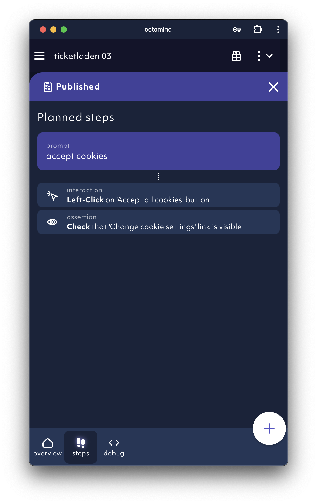
   </Frame>

2. The `login with username and password` test case depends on the `accept cookies` test case.

   <Frame caption="login with username and password depends on 'accept cookies', screenshot 02/2024">
     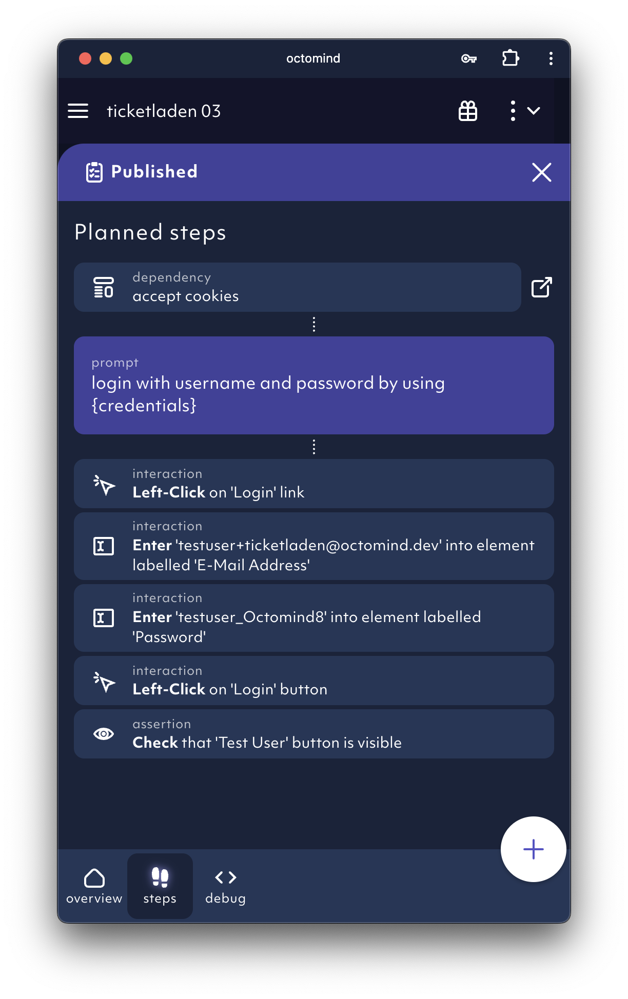
   </Frame>

3. The `open profile` test case depends on the `login with username and password` test case.
   <Frame caption="Open profile depends on login with username and password, screenshot 02/2024">
     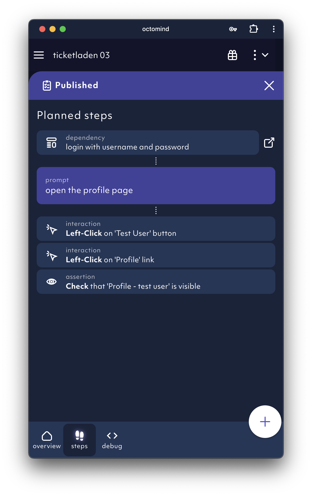
   </Frame>

<Tip>
**Advantages of using dependencies**

- code is reused and only maintained in one place
- much shorter test cases which are easier to understand and debug
- much easier for the AI agent to be successful during code generation since it can concentrate on the main task instead of all the stuff before

</Tip>

## Help the agent out if it went wrong

We are constantly improving the agent but it still might make mistakes. In this case you need to help it find its way.
Use the step inspector to fine tune interactions and assertions.

### Add missing steps

You can add missing steps by clicking the `+` icon and choosing the desired interaction or assertion.

<Frame caption="add missing steps, screenshot 02/2024">
  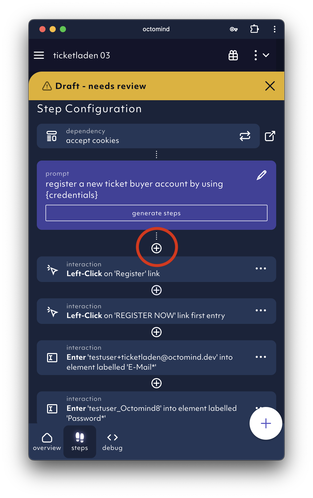
</Frame>

### Delete unnecessary steps

You can easily delete unnecessary steps by clicking the trash can symbol.

<Frame caption="delete obsolete steps, screenshot 02/2024">
  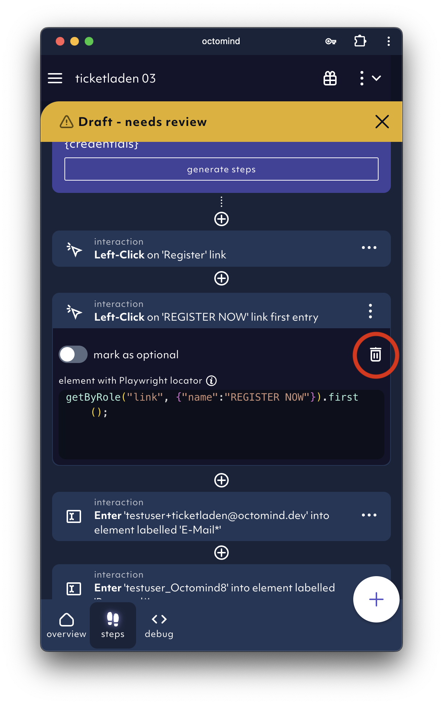
</Frame>

### Run test cases

Running a test case is producing a trace. A trace is a detailed description of what happened during test case execution. Use the trace for debugging.

<Frame caption="run test case for validation, screenshot 02/2024">
  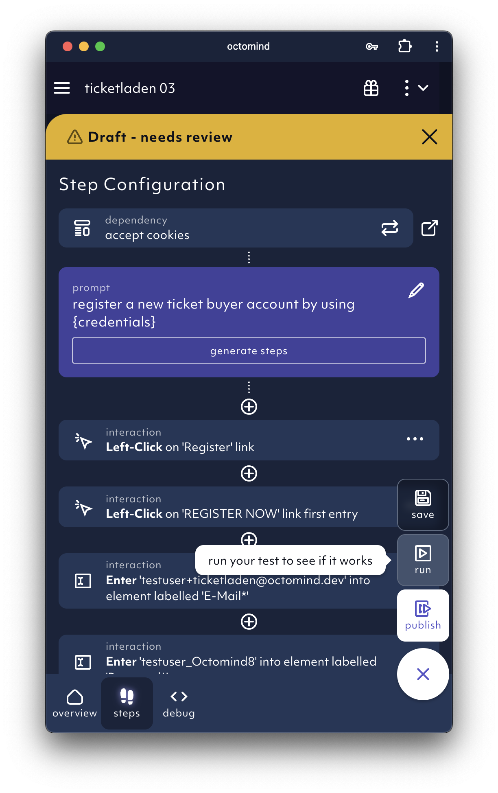
</Frame>

<Tip>
  **Advantages of helping out the agent**

- modifying steps manually is typically much faster than changing the prompts
- You have much more control over the outcome.

</Tip>

## Use `run locally`

`run locally` helps you to save execution time and you can directly see what is happening.
You can find the `run locally` button in the debug section of your test case.

<Frame caption="run locally: copy command view, screenshot 02/2024">
  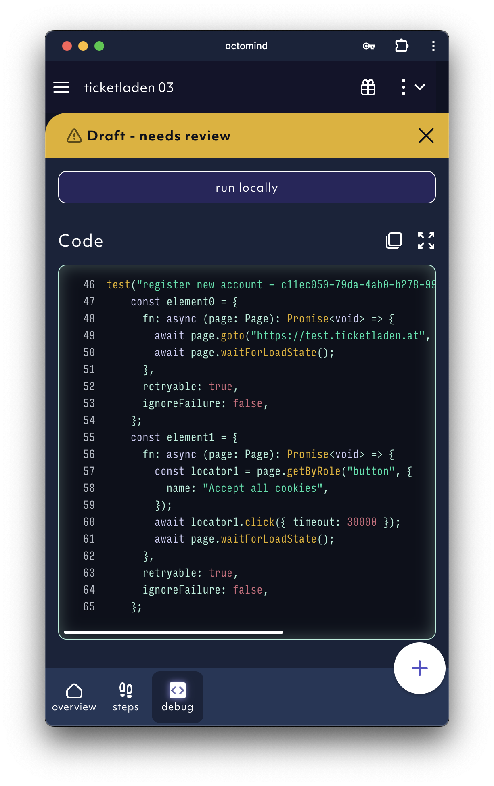
</Frame>

`run locally` is most helpful for step by step adjustments since it is giving you the current state of a page.
You can use the locator tool to easily receive locators. Activate it and click on the desired element.
Then you can copy the locator.

<Frame caption="run locally: locator tool 02/2024">
  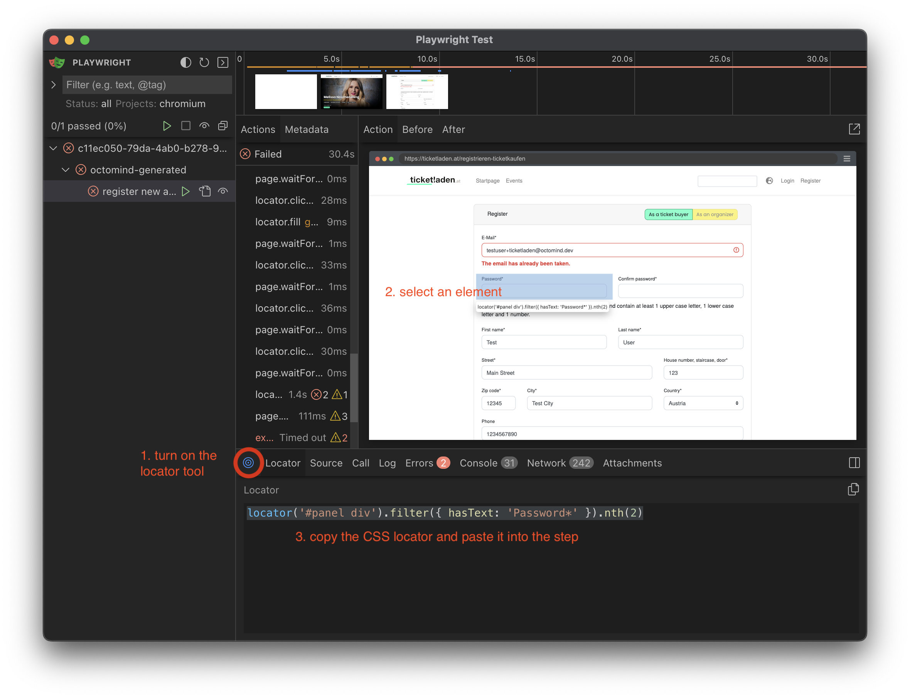
</Frame>

<Tip>
**Advantages of run locally**

Run locally will noticeably speed-up your test creation efforts.

</Tip>

## Outlook

Expect the process for creating test cases to change substantially over the next weeks and months. We are working
hard to make it faster, smoother, more reliable, less error prone and more exciting.
