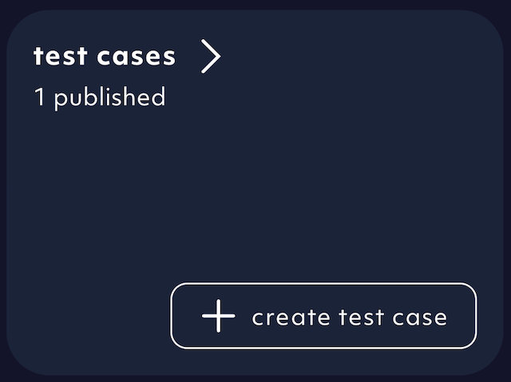
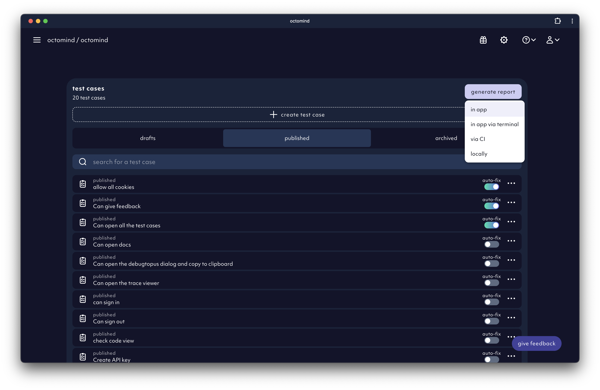

A test case is a set of steps that mimic a user flow. You can find a nice overview of all your test cases inside the test case page. It is accessible from the front page of our app.
It is also the place where to add new test cases or delete old ones.

<Frame caption="02/2024">
  
</Frame>

To run all published test cases and ensure the quality of your page click the "generate report" button and select "in app". Confirm your action by clicking "run"

<Frame caption="02/2024">
  
</Frame>
