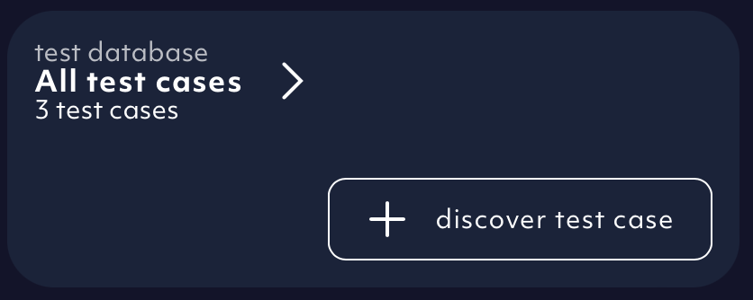
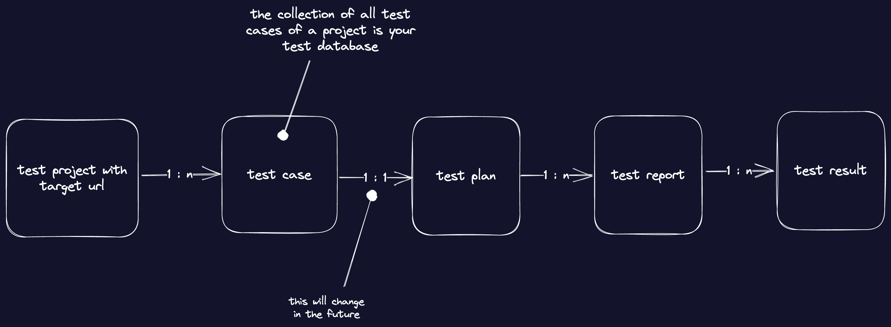

You can find a nice overview of all your test cases inside the test database. It is accessible from the front page of our app.
It is also the place where to add new test cases or delete old test cases.

<Frame caption="Test database on the front page, screenshot 09/2023">
  
</Frame>

<Frame caption="Example test cases displayed within the test database, screenshot 08/2023">
  
</Frame>

## How does the test database fit into the overall picture?

The relationship between the different entities of our system can be described like this:

<Frame caption="Relationship between all the different entities, diagram 08/2023">
  
</Frame>
