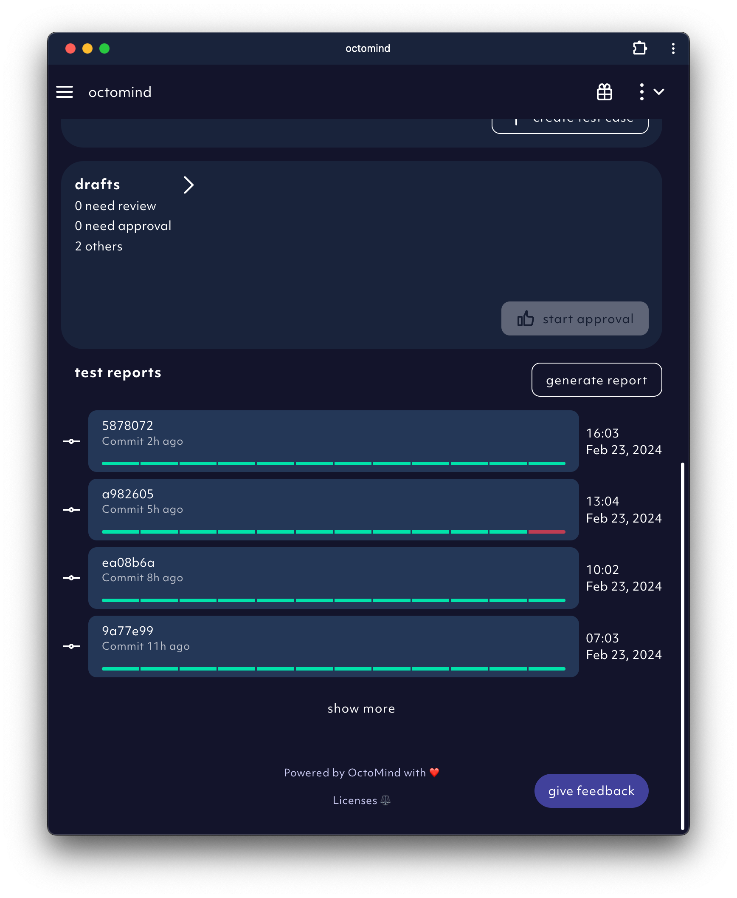

## Test reports

You can always find all test reports in the app. The test report section on the front page is listing all recent reports in chronological order, starting from most recent at the top.
You can also reach the test reports via the sidebar.

<Frame caption="Example of the test report overivew in the app, screenshot 02/2024">
  
</Frame>

## Test report in your CI/CD pipeline

Once tests are executed, and you have integrated octomind into your <a href="/integrations-overview">CI/CD pipeline</a> you can receive a comment in your pull request which looks like the example below.

<Frame caption="Example of Octomind test results in a commit comment, screenshot 09/2023">
  
</Frame>

There will be a row for each test with the following information:

| column      | description                                               |
| ----------- | --------------------------------------------------------- |
| description | name of the test case                                     |
| status ✅   | execution successful                                      |
| status ⌛️   | execution in progress                                     |
| status ❌   | execution failed                                          |
| status 💔   | something went wrong on our side during execution         |
| details     | link which takes you to the test case details (see below) |

## Test report

On the test report overview page you will find a link back to the CI/CD pipeline that triggered it, an overview of
all the results and more details on each of the results.

## Test results

If you click on one of the test results within the test report, you will find details about the execution, as well as further options to understand what the execution did exactly.

<Frame caption="Failed Test result details, auto-playing all the screenshots taken during execution, screenshot 02/2024">
  
</Frame>

- The `failure` state indicates that your app was not working correctly when executing the test..

- In the steps section you can see all the interactions octomind executed for this test run. Each step can be clicked on
  to see the exact screenshot at the time of execution.

## Debugging your test result

In the debug tab you can see advanced options to find the issues in your app.

<Frame caption="Test result debug tab, screenshot 02/2024">
  
</Frame>

- The first step when debugging should be inspecting the execution using the `debug in Trace Viewer` button.
  It will open the **Playwright Trace Viewer**. A trace is similar to a recording, but has a lot additional information that
  come in handy when debugging. It allows you to quickly understand the test execution and the results of each action taken.
  You can get an accurate picture of what went wrong.

<Frame caption="Use Playwright Trace Viewer within Octomind">
  
</Frame>

- Debug your test on your own machine against your local dev environemnt using the `run locally` button. For details please see [Debug your code](/debugtopus).
