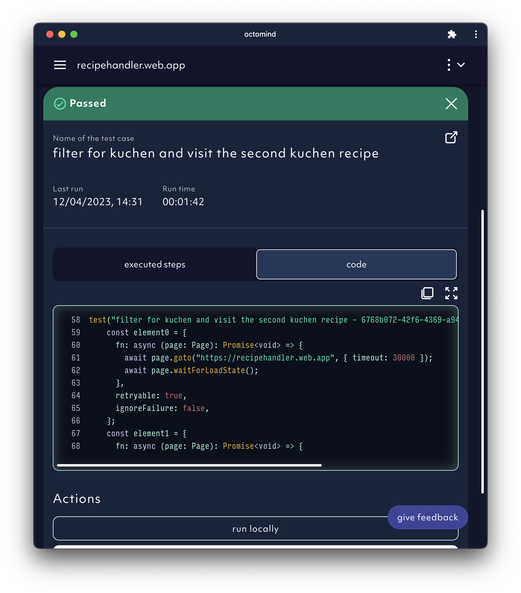
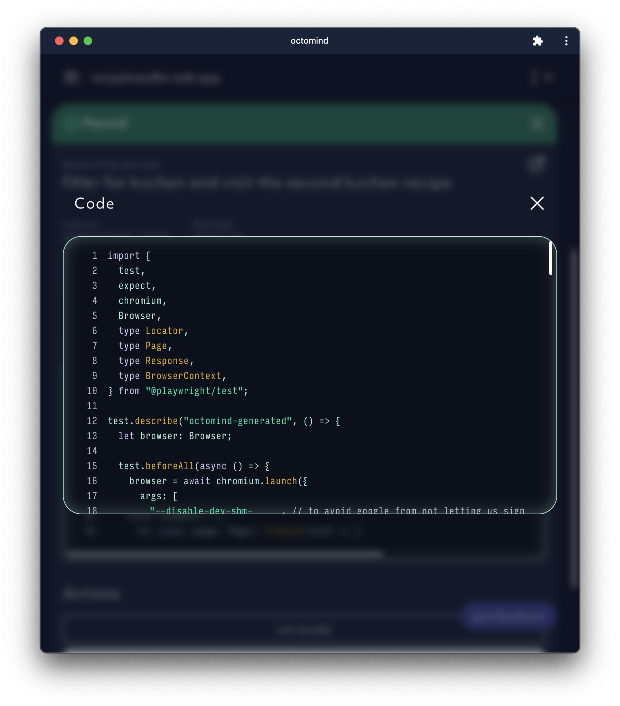

## Test results in app.octomind.dev

You can always find all test results in the app. The test report section on the front page is listing all recent test reports in chronological order.
You can also reach the test results via the sidebar.

<Frame caption="Example of the test report overivew in the app, screenshot 08/2023">
  
</Frame>

## Test results in your CI/CD pipeline

Once tests are executed, you will receive a comment in your GitHub / Azure DevOps pipeline which looks like the example below.

<Frame caption="Example of Octomind test results in a commit comment, screenshot 09/2023">
  
</Frame>

There will be a row for each test with the following information:

| column      | description                                               |
| ----------- | --------------------------------------------------------- |
| description | name of the test case                                     |
| status ✅   | execution successful                                      |
| status ⌛️   | execution in progress                                     |
| status ❌   | execution failed                                          |
| status 💔   | something went wrong on our side during execution         |
| details     | link which takes you to the test case details (see below) |

## Test report

## Test results

If you click on one of the test cases within the test report, you will find details about the execution, as well as further options to interact with the test result based on its result.

<Frame caption="Test result page for a successful test case, screenshot 11/2023">
  
</Frame>

<Frame caption="Test result page for a failed test case, screenshot 09/2023">
  
</Frame>

<Frame caption="Test result page for a waiting-for-execution test case, screenshot 09/2023">
  
</Frame>

<Frame caption="Test result page for a system error test case, screenshot 09/2023">
  
</Frame>

- The `error` state indicates that something went wrong on our side when executing the test.
  You should generally not see tests in this state on a regular basis.

- In the lower section of the test detail page, you can find the interaction chain the system is executing.
  We are working on adding further useful information.

- Below failed test cases, you will see the error log that caused the failure.

## Interacting with test results

On each executed test result, you can:

- Inspect the execution in screenshots of executed steps directly in your test report detail and swipe through the executed steps, screenshot by screenshot.

<Frame caption="In-app screenshot carousel in test report detail, screenshot 11/2023">
  
</Frame>

- View and copy the generated test code directly from the test report detail.

<Frame caption="test code in test report detail, screenshot 11/2023">
  
</Frame>

<Frame caption="test code detail in test report, screenshot 11/2023">
  
</Frame>

- Inspect the execution using the `debug in Trace Viewer` button.
  It will open the **Playwright Trace Viewer**. A trace is similar to a recording, but has a lot additional information that
  comes in handy when debugging. It allows you to quickly understand the test execution and the results of each action taken.
  You can get an accurate picture of what went wrong.

  <Frame caption="Use Playwright Trace Viewer within Octomind">
    
  </Frame>

- Debug your test on your own machine against your local dev environemnt using the `run locally` button. For details please see [Debug your code](/debugtopus).
