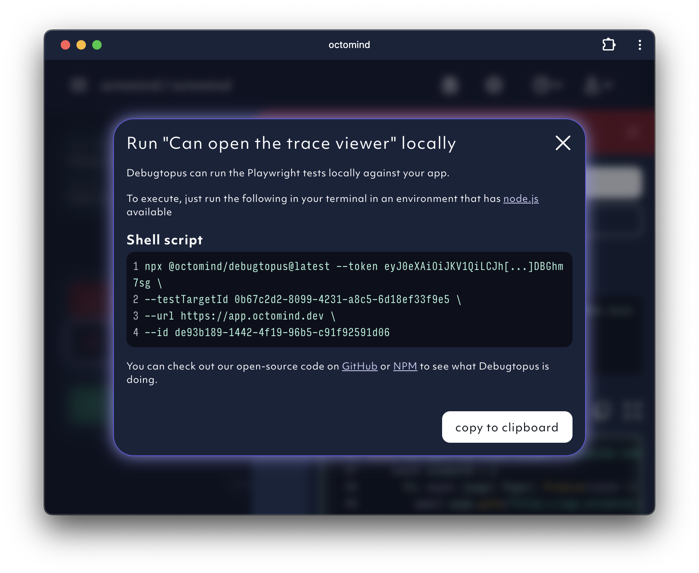

## Test results in your CI/CD pipeline

Once tests are executed, you will receive a comment in your GitHub / Azure DevOps pipeline which might look like the example below.

<Frame caption="Example of Octomind test results in a commit comment, screenshot 06/2023">
  
</Frame>

| column          | description                                                                                                                                         |
| --------------- | --------------------------------------------------------------------------------------------------------------------------------------------------- |
| description     | Name of the test case                                                                                                                               |
| execution state | Can either be running or executed. If a test case is on the list of test cases to be executed but not executed yet, it will not appear in this list |
| status          | checkmark: successfuly executed; hourglass: test case failed and is under investigation; red cross: test case failed                                |
| details         | link which takes you to the test case details (see below)                                                                                           |

## Test result overview in the Octomind app

## Test results in the Octomind app

<Frame caption="Test result page for a successful test case">
  
</Frame>

<Frame caption="Test result page for a failed test case">
  
</Frame>

In the lower section of the test detail page you can find the interaction chain the system is executing. We'll enhance it with additional useful information soon.

## Debugging with Octomind

In the upper right corner you'll find two buttons.`debug test traces` will open the **Playwright Trace Viewer**. It's similar to a recording, but has a lot additional information that comes in handy when debugging.

<Frame caption="Use Playwright Trace Viewer within Octomind">
  
</Frame>

`run locally` gives you a shell script snippet which you can use to run the test case against your local environment. This is good for setting breakpoints and stepping through the code. Click here for the [Debugtopus documentation](/debugtopus)

<Frame caption="Use Debugtopus to run code locally">
  
</Frame>
